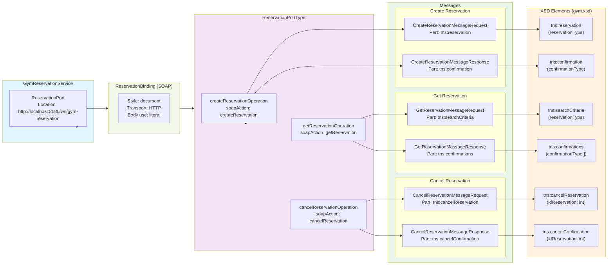
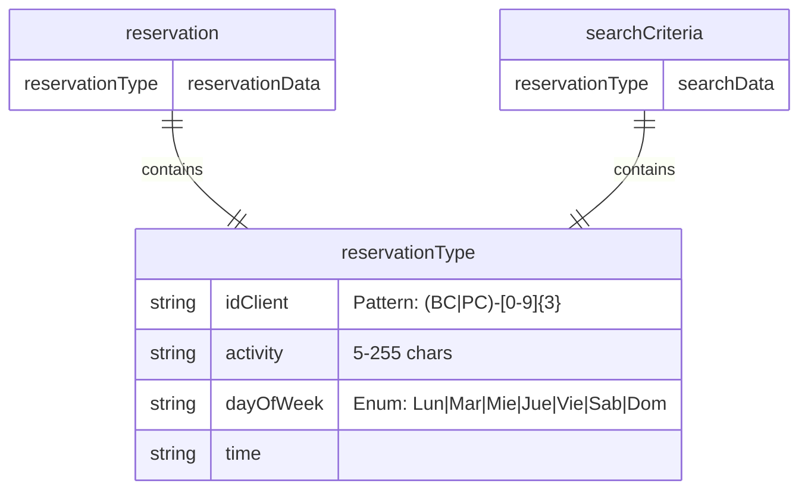
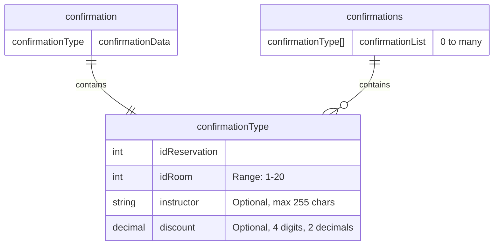
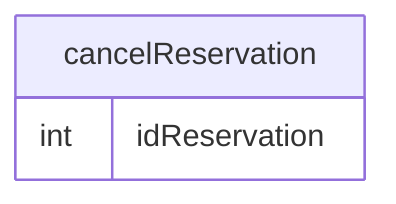
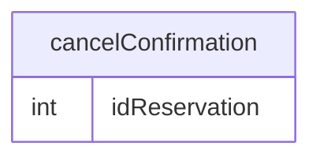

# README

Construcción de Servicios Web tipo SOAP.

## wsdl

Explicación del diagrama:

- Servicio: `GymReservationService` expuesto en <http://localhost:8080/ws/gym-reservation>
- Puerto: `ReservationPort` que usa el binding SOAP
- Binding: `ReservationBinding` con estilo documento, transporte HTTP y uso literal
- Tres operaciones:
  1. `createReservationOperation`: Crear una nueva reserva
  2. `getReservationOperation`: Buscar reservas existentes
  3. `cancelReservationOperation`: Cancelar una reserva
- Mensajes: Cada operación tiene un mensaje de entrada (request) y uno de salida (response)
- Tipos: Todos los elementos están definidos en el XSD `gym.xsd` incluido en la sección `<wsdl:types>`

## gym.xsd

Explicación del diagrama:

- Tipos complejos reutilizables:
  - `reservationType`: Estructura para reservas con validaciones específicas
  - `confirmationType`: Estructura para confirmaciones con campos opcionales

- Elementos raíz:
  - `reservation` y `searchCriteria` usan `reservationType`
  - `confirmation` usa `confirmationType`
  - `confirmations` contiene múltiples `confirmationType`
  - `cancelReservation` y `cancelConfirmation` tienen estructura simple

- Validaciones destacadas:
  - ID cliente sigue patrón BC-XXX o PC-XXX
  - Actividad entre 5-255 caracteres
  - Día de semana limitado a 7 valores
  - Sala entre 1-20
  - Descuento opcional con precisión decimal

### reservationType

### confirmationType

### cancelReservation

### cancelConfirmation

