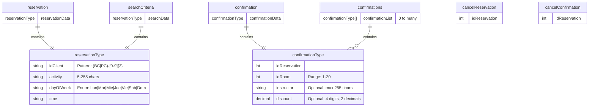
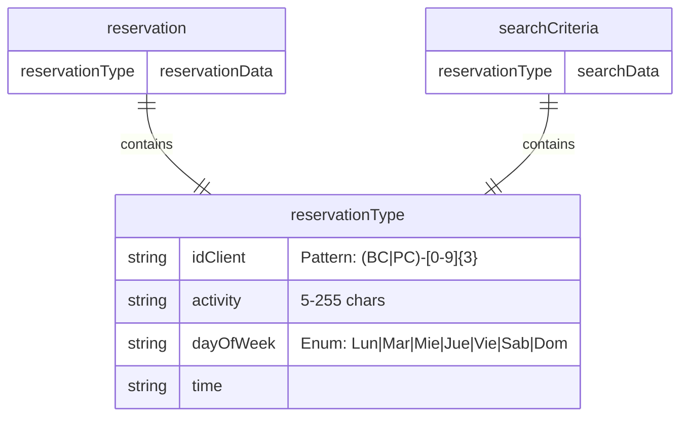
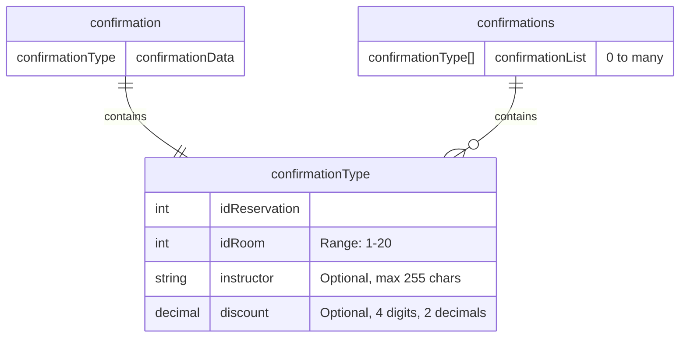
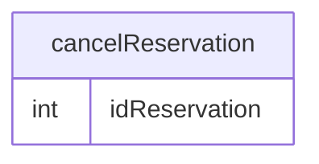
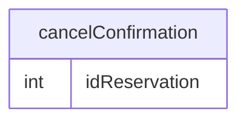

# README

Construcción de Servicios Web tipo SOAP.

## gym.xsd

```mermaid
erDiagram
    reservationType {
        string idClient "Pattern: (BC|PC)-[0-9]{3}"
        string activity "5-255 chars"
        string dayOfWeek "Enum: Lun|Mar|Mie|Jue|Vie|Sab|Dom"
        string time
    }
    
    confirmationType {
        int idReservation
        int idRoom "Range: 1-20"
        string instructor "Optional, max 255 chars"
        decimal discount "Optional, 4 digits, 2 decimals"
    }
    
    reservation {
        reservationType reservationData
    }
    
    searchCriteria {
        reservationType searchData
    }
    
    confirmation {
        confirmationType confirmationData
    }
    
    confirmations {
        confirmationType[] confirmationList "0 to many"
    }
    
    cancelReservation {
        int idReservation
    }
    
    cancelConfirmation {
        int idReservation
    }

    %% Relationships
    reservation ||--|| reservationType : contains
    searchCriteria ||--|| reservationType : contains
    confirmation ||--|| confirmationType : contains
    confirmations ||--o{ confirmationType : contains
```

### reservationType

```mermaid
erDiagram
    reservationType {
        string idClient "Pattern: (BC|PC)-[0-9]{3}"
        string activity "5-255 chars"
        string dayOfWeek "Enum: Lun|Mar|Mie|Jue|Vie|Sab|Dom"
        string time
    }
    
    reservation {
        reservationType reservationData
    }
    
    searchCriteria {
        reservationType searchData
    }

    %% Relationships
    reservation ||--|| reservationType : contains
    searchCriteria ||--|| reservationType : contains
```

### confirmationType

```mermaid
erDiagram
    confirmationType {
        int idReservation
        int idRoom "Range: 1-20"
        string instructor "Optional, max 255 chars"
        decimal discount "Optional, 4 digits, 2 decimals"
    }
    
    confirmation {
        confirmationType confirmationData
    }
    
    confirmations {
        confirmationType[] confirmationList "0 to many"
    }
    
    %% Relationships
 
    confirmation ||--|| confirmationType : contains
    confirmations ||--o{ confirmationType : contains
```

### cancelReservation

```mermaid
erDiagram
    cancelReservation {
        int idReservation
    }
```

### confirmationType

```mermaid
erDiagram
    cancelConfirmation {
        int idReservation
    }
```
