# Docker conceptos fundamentales

## 1. 🏗️ Arquitectura General de Docker

Imagina Docker como una **fábrica moderna automatizada** donde cada componente tiene un rol específico y bien definido:

**🎯 Conceptos Fundamentales:**

- **Docker Engine**: Es el "corazón" del sistema - un motor que gestiona todo el ciclo de vida de los contenedores
- **Docker Daemon (dockerd)**: El "trabajador silencioso" que ejecuta en segundo plano y hace todo el trabajo pesado
- **Docker CLI**: Tu "panel de control" - la interfaz donde escribes comandos como `docker run`, `docker build`
- **Docker API**: El "traductor" que convierte tus comandos en acciones que entiende el daemon
- **Objects**: Los "productos" que maneja Docker - imágenes, contenedores, volúmenes y redes

**💡 Analogía:**  
Docker es como dirigir una orquesta sinfónica:

- **Tú (Developer)** = Director de orquesta
- **CLI** = Batuta del director
- **API** = Partitura musical
- **Daemon** = Concertino que coordina
- **Objects** = Diferentes secciones (violines=containers, piano=images, etc.)

**🔑 Punto Clave:** Todo comienza con el kernel de Linux que proporciona las tecnologías fundamentales (cgroups y namespaces) que hacen posible el aislamiento de contenedores.

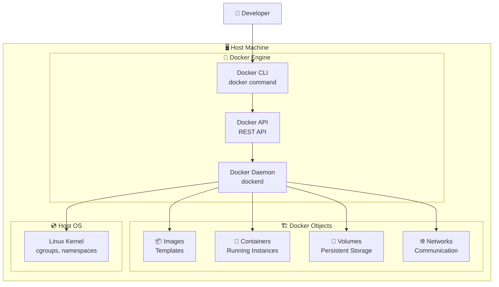

---

## 2. 📦 Image vs Container - La Diferencia Fundamental

**🎯 Conceptos Esenciales:**

- **Image = Receta de cocina** 📜 (instrucciones para hacer un platillo)
- **Container = Platillo preparado** 🍽️ (el resultado de seguir la receta)
- **Layers = Pasos de la receta** (cada instrucción del Dockerfile crea una capa)
- **Writable Layer = Personalización individual** (cada comensal puede agregar sal o salsa)

**💡 Analogía de la Construcción:**  
Piensa en construir casas:

- **Image** = Planos arquitectónicos (blueprint)
- **Layers** = Diferentes fases de construcción (cimientos, paredes, techo, pintura)
- **Container** = Casa construida y habitada
- **Writable Layer** = Decoración personal del inquilino

**🔑 Puntos Críticos:**

1. **Una imagen** puede crear **infinitos contenedores**
2. **Las imágenes NUNCA cambian** (son inmutables)
3. **Cada contenedor tiene su propia área de trabajo** (writable layer)
4. **Las capas se reutilizan** entre imágenes para ahorrar espacio

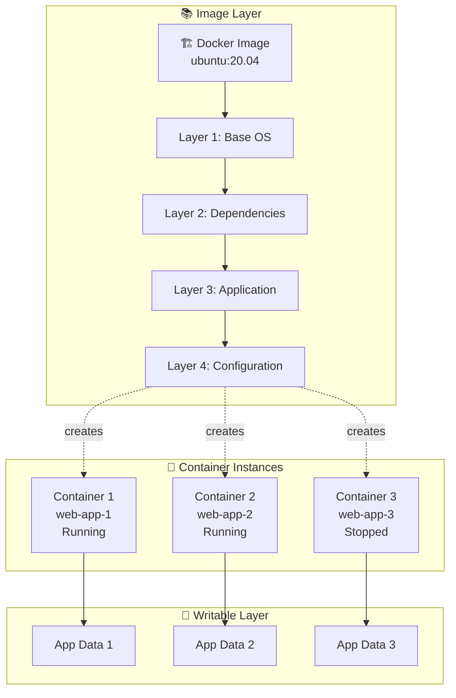

---

## 3. 🔨 Dockerfile - La Receta de Construcción

El Dockerfile es tu **"receta"** para crear imágenes Docker. Cada línea es una instrucción que se ejecuta secuencialmente, y cada instrucción crea una nueva capa en la imagen.

**🎯 Instrucciones Fundamentales:**

- **FROM**: "Comenzar con este ingrediente base" - define la imagen padre
- **RUN**: "Ejecutar este comando ahora durante la construcción" - instala paquetes, compila código
- **COPY**: "Traer estos archivos desde mi computadora al contenedor"
- **EXPOSE**: "Esta aplicación usará este puerto" - documentación, no abre el puerto
- **CMD**: "Cuando alguien ejecute un contenedor de esta imagen, ejecuta esto por defecto"

**💡 Principios de Optimización:**

1. **Orden importa**: Instrucciones que cambian frecuentemente van al final
2. **Capas mínimas**: Combina comandos RUN relacionados con &&
3. **Cache de capas**: Docker reutiliza capas si no han cambiado
4. **Multi-stage builds**: Usa múltiples FROM para optimizar tamaño final

**🔑 Analogía del Chef:**  
Imagínate escribiendo una receta de cocina profesional:

- FROM = "Empezar con una olla limpia"
- RUN = "Hervir agua por 10 minutos"
- COPY = "Agregar los ingredientes preparados"
- EXPOSE = "Servir en plato caliente"
- CMD = "Servir inmediatamente"

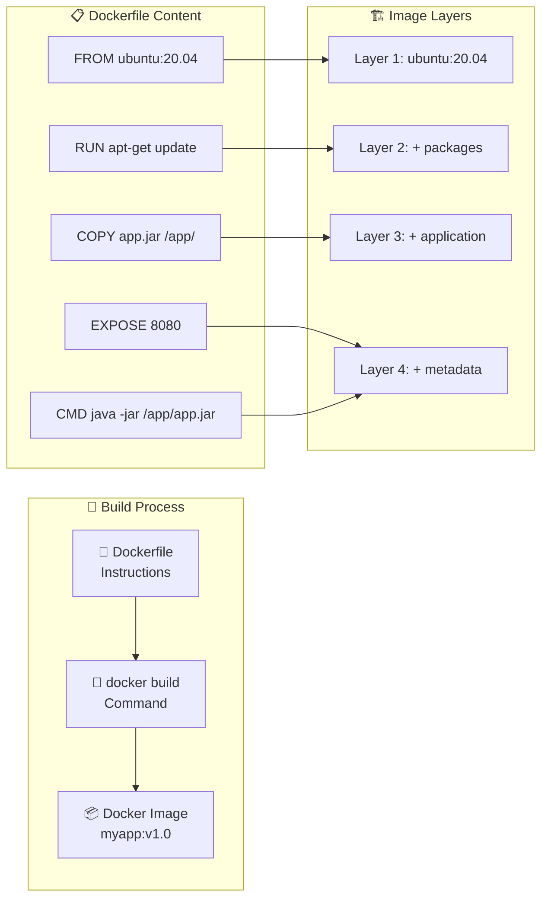

---

## 4. 🔄 Container Lifecycle - Estados de Vida del Contenedor

Un contenedor Docker pasa por diferentes **estados de vida**, similar a cómo un proceso en tu sistema operativo puede estar ejecutándose, pausado, o detenido.

**🎯 Estados Críticos del Contenedor:**

- **Created**: "Existe en papel pero no está activo" - configurado pero no ejecutándose
- **Running**: "Activo y trabajando" - consumiendo CPU, memoria, ejecutando procesos
- **Paused**: "Congelado temporalmente" - todos los procesos suspendidos, estado en memoria preservado
- **Stopped**: "Detenido limpiamente" - procesos terminados, estado del filesystem preservado
- **Killed**: "Terminación forzada" - como usar Ctrl+C o kill -9 en Linux

**💡 Analogía del Semáforo:**  
Piensa en un auto en diferentes estados:

- **Created** = Auto estacionado con motor apagado
- **Running** = Auto en movimiento, consumiendo gasolina
- **Paused** = Auto detenido en semáforo rojo, motor encendido
- **Stopped** = Auto estacionado, motor apagado ordenadamente
- **Killed** = Auto con motor fundido (terminación abrupta)

**🔑 Transiciones Importantes:**

1. **Restart Policy**: Define qué hacer si el contenedor falla
2. **Graceful Shutdown**: `docker stop` permite terminación limpia (SIGTERM + SIGKILL)
3. **Data Persistence**: Solo los volúmenes sobreviven al ciclo de vida del contenedor

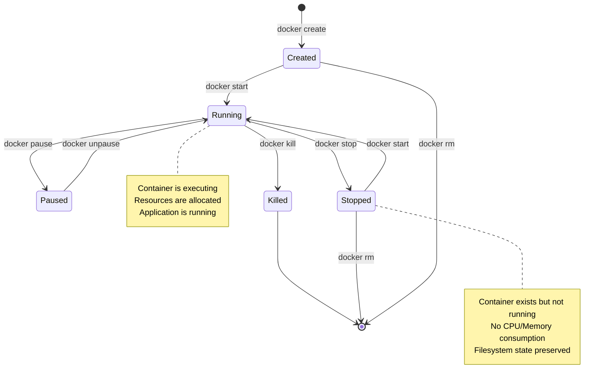

---

## 5. 💾 Volumes - El Sistema de Almacenamiento Inteligente

Los volúmenes resuelven **el problema fundamental de persistencia de datos** en contenedores. Sin volúmenes, todos los datos se pierden cuando eliminas un contenedor.

**🎯 Los Tres Tipos de Almacenamiento en Docker:**

**1. Named Volumes** (🏆 Recomendado para Producción):

- **Analogía**: "Caja de seguridad en el banco" - Docker la administra por ti
- **Ventajas**: Portables, respaldables, independientes del host
- **Uso**: Bases de datos, logs de aplicación, datos críticos

**2. Bind Mounts** (🛠️ Perfecto para Desarrollo):

- **Analogía**: "Carpeta compartida" - acceso directo desde tu PC
- **Ventajas**: Cambios inmediatos, fácil edición, desarrollo ágil
- **Desventajas**: Dependiente del sistema host, problemas de permisos

**3. tmpfs Mounts** (⚡ Para Datos Temporales):

- **Analogía**: "Pizarra en RAM" - súper rápido pero se borra
- **Ventajas**: Velocidad extrema, seguridad (no toca disco)
- **Desventajas**: Volátil, limitado por RAM disponible

**🔑 Regla de Oro para Recordar:**

- **Desarrollo** → Bind Mounts (quiero ver cambios inmediatos)
- **Producción** → Named Volumes (Docker se encarga de todo)
- **Cache/Temporal** → tmpfs (velocidad máxima, datos no críticos)

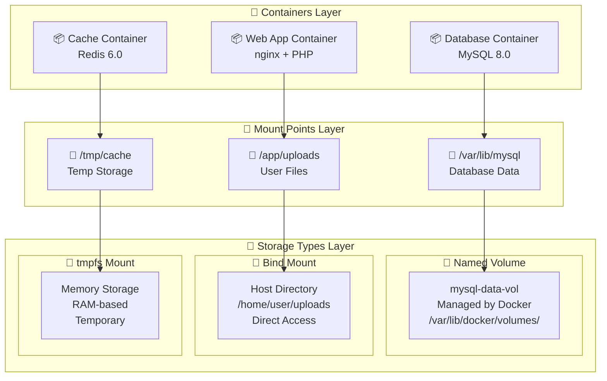

---

## 6. 🌐 Networks - El Sistema Nervioso de los Contenedores

Las redes en Docker son como **diferentes tipos de vecindarios** donde pueden vivir tus contenedores, cada uno con sus propias reglas de comunicación y seguridad.

**🎯 Los Cuatro Tipos de Redes:**

**1. bridge (default)** - "Vecindario básico":

- **Analogía**: Departamentos en un edificio básico
- **Características**: Comunicación por IP, sin nombres DNS automáticos
- **Uso**: Contenedores simples que no necesitan comunicarse mucho

**2. custom bridge** - "Condominio premium":

- **Analogía**: Vecindario privado con directorio telefónico
- **Ventajas**: DNS automático (contenedores se llaman por nombre), mejor aislamiento
- **Uso**: Aplicaciones multi-contenedor (recomendado)

**3. host** - "Casa compartida con el anfitrión":

- **Analogía**: Vivir en la misma casa que el dueño
- **Ventajas**: Máximo rendimiento de red, sin traducción NAT
- **Desventajas**: Sin aislamiento, posibles conflictos de puertos

**4. none** - "Ermitaño total":

- **Analogía**: Cabaña aislada sin teléfono ni internet
- **Uso**: Procesamiento batch, trabajos que no necesitan red

**🔑 Principio Fundamental:**  
Los contenedores en la **misma red personalizada** pueden comunicarse usando nombres de contenedor como si fueran nombres de dominio.

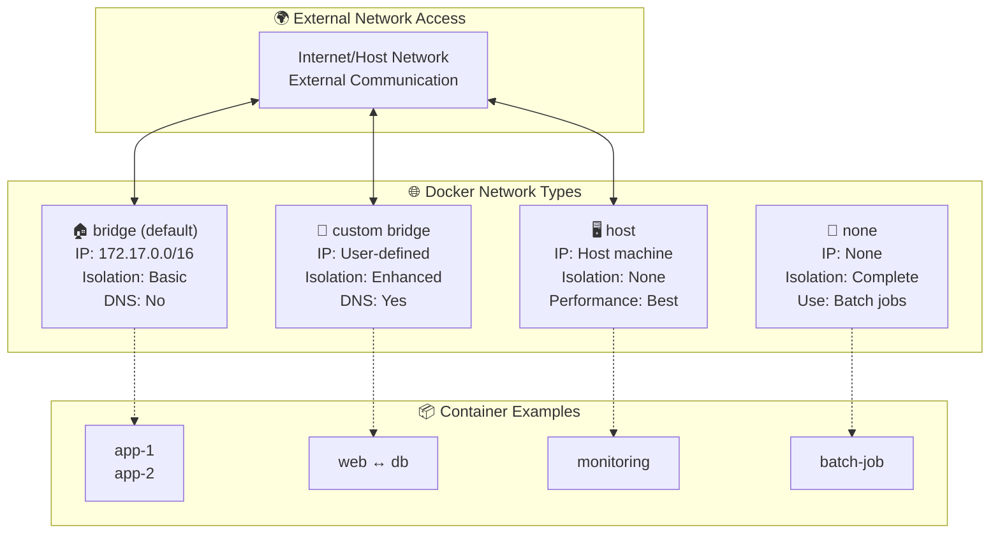

---

## 7. 🎼 Docker Compose - El Director de Orquesta

Docker Compose es tu **"director de orquesta digital"** que coordina múltiples contenedores para crear una aplicación completa y armoniosa.

**🎯 Conceptos Fundamentales:**

- **Services**: Los "músicos" de tu orquesta (web server, database, cache, API)
- **Networks**: Los "cables y conexiones" que permiten a los músicos comunicarse
- **Volumes**: Los "atriles" donde cada músico guarda su partitura (datos persistentes)
- **docker-compose.yml**: La "partitura principal" que todos siguen

**💡 Analogía de la Banda Musical:**  
Imagina dirigir una banda con:

- **Guitarrista** (web server) - produce la melodía principal
- **Bajista** (database) - proporciona la base de datos
- **Baterista** (cache) - mantiene el ritmo rápido
- **Vocalista** (API) - interactúa con la audiencia

**🔑 Ventajas Clave:**

1. **Un comando para todo**: `docker-compose up` levanta toda la aplicación
2. **Definición declarativa**: Describes QUÉ quieres, no CÓMO hacerlo
3. **Entornos consistentes**: Mismo comportamiento en desarrollo y pruebas
4. **Escalabilidad simple**: `docker-compose up --scale api=3`

**🎯 Patrones Comunes:**

- **LAMP Stack**: Linux + Apache + MySQL + PHP
- **MEAN Stack**: MongoDB + Express + Angular + Node.js
- **Microservicios**: API + Database + Cache + Queue + Worker

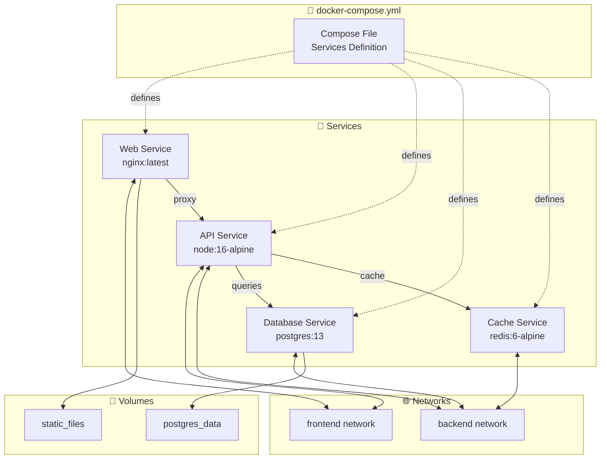

---

## 8. 🏭 Docker Stack - La Fábrica Multinacional

Docker Stack es como administrar una **corporación multinacional** con múltiples plantas de producción (nodos) que fabrican el mismo producto (servicio) con alta disponibilidad y tolerancia a fallos.

**🎯 Escalamiento Conceptual:**

- **Docker Compose**: "Taller artesanal" (una sola máquina, desarrollo local)
- **Docker Stack**: "Fábrica industrial" (múltiples máquinas, producción global)

**🎯 Componentes de la Fábrica:**

- **Managers**: Los "directores ejecutivos" que toman decisiones estratégicas y coordinan
- **Workers**: Los "supervisores de planta" que ejecutan el trabajo operativo
- **Services**: Los "productos" que se fabrican en múltiples líneas de producción
- **Tasks/Replicas**: Las "unidades individuales" de cada producto en cada planta

**💡 Analogía Industrial:**  
Imagina una empresa como Boing:

- **Sede Central** (Manager nodes) decide QUÉ producir y DÓNDE
- **Plantas Regionales** (Worker nodes) ejecutan la producción
- **Producto** (Service) = Boing, pero se produce en múltiples plantas
- **Lotes** (Tasks) = Cada botella individual producida

**🔑 Beneficios de Producción:**

1. **Alta Disponibilidad**: Si una planta falla, las otras siguen funcionando
2. **Balanceo de Carga**: Las órdenes se distribuyen automáticamente
3. **Auto-recovery**: Si una máquina falla, se reemplaza automáticamente
4. **Rolling Updates**: Actualizar sin detener la producción

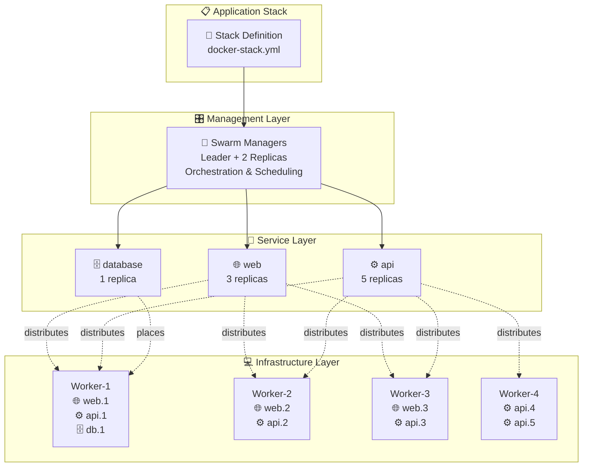

---

## 9. 🎯 Service Discovery y Load Balancing - El Sistema de Distribución Inteligente

Este concepto representa el **"cerebro logístico"** de Docker Swarm que resuelve dos problemas fundamentales: "¿Cómo encuentro los servicios?" y "¿Cómo distribuyo el trabajo equitativamente?"

**🎯 Conceptos Clave:**

- **VIP (Virtual IP)**: La "dirección postal única" del servicio - los clientes siempre van a la misma dirección
- **Service Discovery**: El "GPS interno" que encuentra automáticamente dónde están los servicios
- **Load Balancer**: El "distribuidor inteligente" que reparte el trabajo
- **Health Checks**: Los "inspectores de calidad" que verifican que todo funcione bien

**💡 Analogía del Call Center:**  
Imagina un call center de soporte técnico:

- **Número principal** (VIP) = 1-800-SUPPORT (siempre el mismo)
- **Sistema telefónico** (Load Balancer) = distribuye llamadas automáticamente
- **Agentes disponibles** (Healthy tasks) = operadores listos para atender
- **Monitor de supervisión** (Health checks) = verifica que agentes estén activos

**🔑 Algoritmos de Distribución:**

1. **Round Robin**: "Turno rotativo" - agente 1, luego 2, luego 3, vuelta al 1
2. **Least Connections**: Al agente con menos llamadas activas
3. **Health-based**: Solo a agentes que pasaron el examen médico

**💪 Beneficio Principal:** Los clientes nunca necesitan saber cuántos servidores hay o cuáles están disponibles - el sistema maneja toda la complejidad internamente.

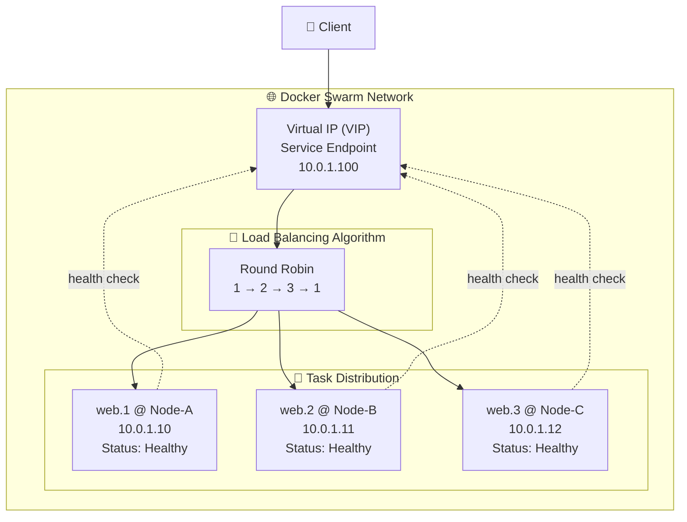

---

## 10. 🏢 Stack de Producción Completo - La Arquitectura Empresarial

Este diagrama representa una **arquitectura de producción real** como las que usan empresas como Netflix, Uber o cualquier aplicación web moderna. Es la culminación de todos los conceptos anteriores trabajando juntos.

**🎯 Arquitectura por Capas (Principio de Separación de Responsabilidades):**

**🌐 Frontend Tier** - "La Cara de la Empresa":

- **Load Balancer**: El "recepcionista principal" que recibe todas las visitas
- **Web Applications**: Los "agentes de atención al cliente" que manejan la interfaz

**⚙️ Backend Tier** - "El Motor de la Empresa":

- **API Services**: Los "empleados especializados" que procesan lógica de negocio
- **Background Workers**: Los "trabajadores nocturnos" que procesan tareas pesadas

**💾 Data Tier** - "El Cerebro de la Empresa":

- **Database**: La "memoria permanente" con toda la información crítica
- **Cache**: La "memoria de trabajo rápida" para acceso inmediato

**📊 Monitoring Tier** - "El Sistema de Vigilancia":

- **Metrics**: Los "indicadores del tablero" (CPU, memoria, requests/segundo)
- **Logs**: El "archivo histórico" de todo lo que ha pasado

**🔑 Principios de Diseño:**

1. **Escalabilidad Horizontal**: Cada capa puede crecer independientemente
2. **Fault Tolerance**: Si falla un componente, los demás siguen funcionando
3. **Separation of Concerns**: Cada capa tiene una responsabilidad específica
4. **Observability**: Monitoreo completo para detectar y resolver problemas

**💡 Analogía Empresarial:**  
Es como organizar una empresa multinacional:

- **Frontend** = Sucursales y atención al cliente
- **Backend** = Oficinas centrales y procesamiento
- **Data** = Contabilidad y archivo central
- **Monitoring** = Auditoría y control de calidad

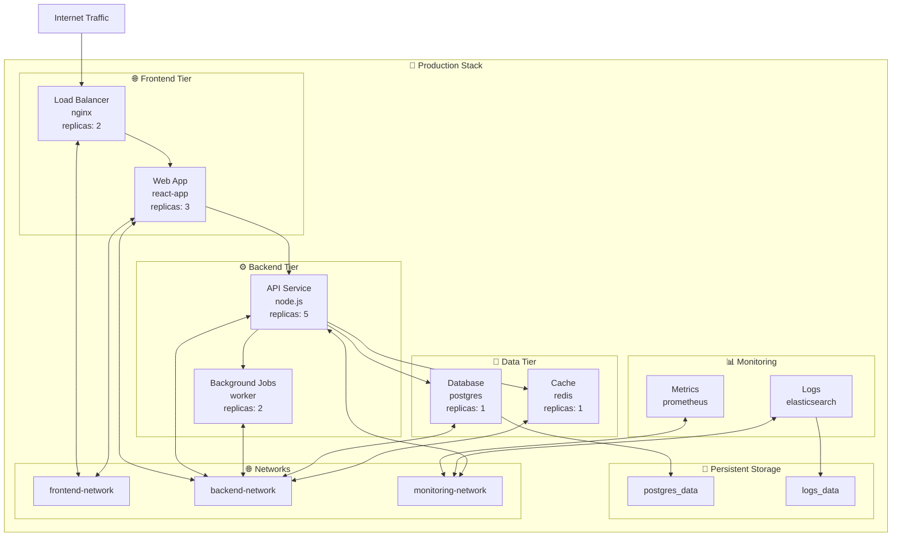

---

## 11. 🥊 Container vs VM - La Revolución del Paradigma

Esta comparación explica **por qué Docker cambió completamente la industria del software**. Es la diferencia entre la arquitectura tradicional y la moderna.

**🎯 Virtual Machines** - "El Modelo Tradicional":  
**Analogía del Hotel:** Cada huésped (aplicación) renta una habitación completa con baño privado, cocina, y servicios individuales

- **Ventajas**: Aislamiento total, diferentes sistemas operativos
- **Desventajas**: Costoso en recursos, lento para iniciar, desperdicio de espacio

**🎯 Containers** - "La Revolución Moderna":  
**Analogía del Hostel:** Múltiples viajeros comparten cocina y servicios comunes, pero cada uno tiene su cama privada

- **Ventajas**: Eficiente en recursos, arranque instantáneo, mayor densidad
- **Desventajas**: Mismo kernel, menor aislamiento que VMs

**🔑 Números que Importan:**

- **VM**: Gigabytes de RAM, minutos para arrancar, ~10 VMs por servidor
- **Container**: Megabytes de RAM, segundos para arrancar, ~100+ contenedores por servidor

**💡 Cuándo Usar Cada Uno:**

- **VMs**: Diferentes sistemas operativos, máximo aislamiento de seguridad, aplicaciones legacy
- **Containers**: Mismo OS, microservicios, CI/CD, desarrollo ágil

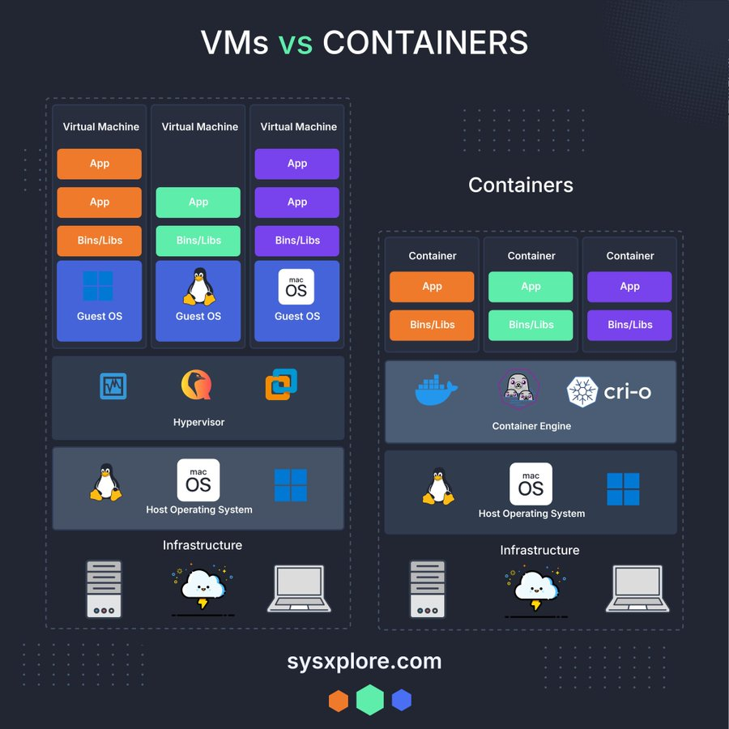

---

## 12. 🔄 Development Workflow - El Ciclo de Vida del Software Moderno

Este diagrama muestra el **"pipeline de software moderno"** - el viaje que hace tu código desde tu computadora hasta que los usuarios finales lo usan en producción.

**🎯 Las 5 Estaciones del Pipeline:**

**1. 👨‍💻 Write Code** - "El Laboratorio del Científico":

- Donde nace la innovación
- Tu entorno de desarrollo local
- Experimentos, pruebas, creatividad

**2. 🔧 Build Image** - "La Fábrica de Empaquetado":

- Tu código se convierte en un "producto terminado"
- Dockerfile define el proceso de manufactura
- Resultado: Una imagen lista para distribuir

**3. 🧪 Test Local** - "Control de Calidad":

- Verificación antes del lanzamiento
- Pruebas unitarias, integración, performance
- "Medir dos veces, cortar una vez"

**4. 📤 Push Registry** - "El Almacén Central":

- Tu "producto" se almacena en un lugar accesible globalmente
- Docker Hub, AWS ECR, Google Container Registry
- Como un "GitHub para imágenes"

**5. 🚀 Deploy Production** - "Lanzamiento al Mercado":

- Tu aplicación se ejecuta en servidores de producción
- Los usuarios reales pueden acceder
- Monitoreo y feedback continuo

**🔄 El Ciclo Continuo:**  
El feedback de producción (bugs, nuevas funcionalidades, performance) alimenta nuevas iteraciones de desarrollo, creando un ciclo de mejora continua.

**💡 Principio DevOps:**  
"Automatiza todo lo que puedas, mide todo lo que importa, mejora continuamente"

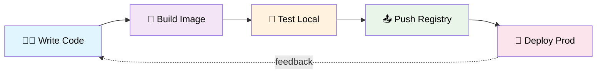

## Comandos Esenciales

```bash
# Imágenes
docker build -t myapp:v1.0 .          # Construir imagen
docker images                         # Listar imágenes
docker pull nginx:latest              # Descargar imagen

# Contenedores
docker run -d --name web nginx        # Ejecutar contenedor
docker ps                             # Listar contenedores activos
docker ps -a                          # Listar todos los contenedores
docker stop web                       # Detener contenedor
docker rm web                         # Eliminar contenedor

# Volúmenes
docker volume create mydata           # Crear volumen
docker volume ls                      # Listar volúmenes
docker run -v mydata:/data nginx      # Usar volumen

# Redes
docker network create mynet           # Crear red
docker network ls                     # Listar redes
docker run --network mynet nginx      # Usar red personalizada

# Docker Compose
docker-compose up -d                  # Ejecutar servicios
docker-compose down                   # Detener servicios
docker-compose logs                   # Ver logs

# Docker Stack (Swarm)
docker stack deploy -c stack.yml app  # Desplegar stack
docker stack ls                       # Listar stacks
docker service ls                     # Listar servicios
```

## Conceptos Clave a Recordar

1. **Images**: Plantillas inmutables para crear contenedores
2. **Containers**: Instancias ejecutables de las imágenes
3. **Volumes**: Almacenamiento persistente independiente del contenedor
4. **Networks**: Comunicación segura entre contenedores
5. **Services**: Definición de cómo ejecutar contenedores en producción
6. **Stacks**: Colección de servicios que forman una aplicación completa
7. **Orchestration**: Gestión automatizada de múltiples contenedores

Docker simplifica el despliegue y la gestión de aplicaciones mediante contenedores ligeros y portables, permitiendo que las aplicaciones funcionen consistentemente en cualquier entorno.
