# Docker conceptos fundamentales

## Introducción

Docker es una plataforma de contenedores que permite empaquetar aplicaciones y sus dependencias en contenedores ligeros y portables. Piensa en Docker como un sistema de "cajas inteligentes" que contienen todo lo necesario para que una aplicación funcione en cualquier lugar.

## 1. Arquitectura General de Docker

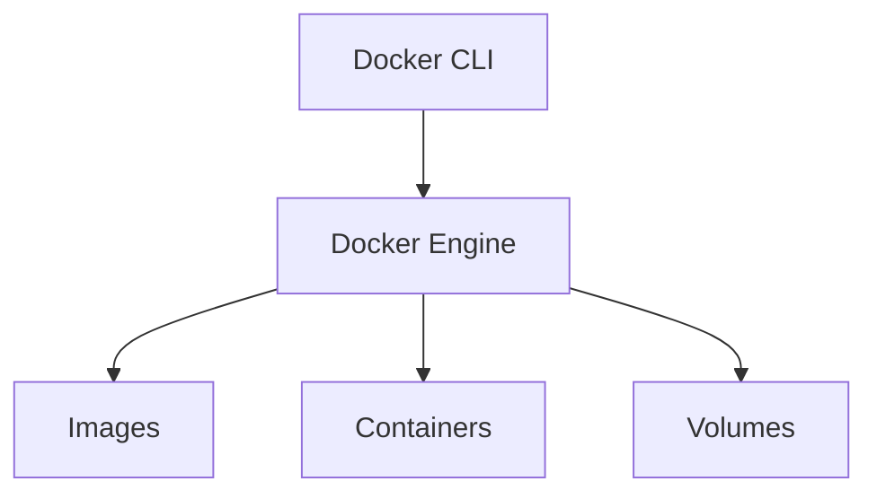

```mermaid
graph TD
    subgraph "🖥️ Host Machine"
        subgraph "🐳 Docker Engine"
            DAEMON[Docker Daemon<br/>dockerd]
            API[Docker API<br/>REST API]
            CLI[Docker CLI<br/>docker command]
        end
        
        subgraph "🏗️ Docker Objects"
            IMAGES[📦 Images<br/>Templates]
            CONTAINERS[🚀 Containers<br/>Running Instances]
            VOLUMES[💾 Volumes<br/>Persistent Storage]
            NETWORKS[🌐 Networks<br/>Communication]
        end
        
        subgraph "💿 Host OS"
            KERNEL[Linux Kernel<br/>cgroups, namespaces]
        end
    end
    
    USER[👤 Developer] --> CLI
    CLI --> API
    API --> DAEMON
    DAEMON --> IMAGES
    DAEMON --> CONTAINERS
    DAEMON --> VOLUMES
    DAEMON --> NETWORKS
    DAEMON --> KERNEL
```

**Componentes principales:**
- **Docker Engine**: Motor principal que gestiona contenedores
- **Images**: Plantillas inmutables para crear contenedores
- **Containers**: Instancias ejecutables de las imágenes
- **Volumes**: Almacenamiento persistente
- **Networks**: Comunicación entre contenedores

## 2. Image vs Container: La Base

```mermaid
graph TD
    subgraph "📚 Image Layer"
        IMG[🏗️ Docker Image<br/>ubuntu:20.04]
        LAYER1[Layer 1: Base OS]
        LAYER2[Layer 2: Dependencies]
        LAYER3[Layer 3: Application]
        LAYER4[Layer 4: Configuration]
    end
    
    subgraph "🚀 Container Instances"
        CONT1[Container 1<br/>web-app-1<br/>Running]
        CONT2[Container 2<br/>web-app-2<br/>Running]
        CONT3[Container 3<br/>web-app-3<br/>Stopped]
    end
    
    subgraph "💾 Writable Layer"
        WRITE1[App Data 1]
        WRITE2[App Data 2]
        WRITE3[App Data 3]
    end
    
    IMG --> LAYER1
    LAYER1 --> LAYER2
    LAYER2 --> LAYER3
    LAYER3 --> LAYER4
    
    LAYER4 -.->|"creates"| CONT1
    LAYER4 -.->|"creates"| CONT2
    LAYER4 -.->|"creates"| CONT3
    
    CONT1 --> WRITE1
    CONT2 --> WRITE2
    CONT3 --> WRITE3
```

**Conceptos clave:**
- **Image**: Plantilla inmutable, como un "molde"
- **Container**: Instancia ejecutable, como un "objeto creado del molde"
- **Layers**: Imágenes se construyen en capas reutilizables
- **Writable Layer**: Cada contenedor tiene su propia capa de escritura

## 3. Dockerfile: Construcción de Imágenes

```mermaid
graph LR
    subgraph "🔨 Build Process"
        DF[📄 Dockerfile<br/>Instructions]
        BUILD[🔧 docker build<br/>Command]
        IMG[📦 Docker Image<br/>myapp:v1.0]
    end
    
    subgraph "📋 Dockerfile Content"
        FROM[FROM ubuntu:20.04]
        RUN[RUN apt-get update]
        COPY[COPY app.jar /app/]
        EXPOSE[EXPOSE 8080]
        CMD[CMD java -jar /app/app.jar]
    end
    
    subgraph "🏗️ Image Layers"
        L1[Layer 1: ubuntu:20.04]
        L2[Layer 2: + packages]
        L3[Layer 3: + application]
        L4[Layer 4: + metadata]
    end
    
    DF --> BUILD
    BUILD --> IMG
    
    FROM --> L1
    RUN --> L2
    COPY --> L3
    EXPOSE --> L4
    CMD --> L4
```

## 4. Container Lifecycle: Ciclo de Vida


## 5. Volumes: Almacenamiento Persistente

```mermaid
graph TD
    subgraph "🚀 Containers Layer"
        CONT1["📦 Database Container<br/>MySQL 8.0"]
        CONT2["📦 Web App Container<br/>nginx + PHP"]
        CONT3["📦 Cache Container<br/>Redis 6.0"]
    end
    
    subgraph "📂 Mount Points Layer"
        MP1["🔗 /var/lib/mysql<br/>Database Data"]
        MP2["🔗 /app/uploads<br/>User Files"]
        MP3["🔗 /tmp/cache<br/>Temp Storage"]
    end
    
    subgraph "💾 Storage Types Layer"
        subgraph "📁 Named Volume"
            NV["mysql-data-vol<br/>Managed by Docker<br/>/var/lib/docker/volumes/"]
        end
        
        subgraph "🔗 Bind Mount"
            BM["Host Directory<br/>/home/user/uploads<br/>Direct Access"]
        end
        
        subgraph "💨 tmpfs Mount"
            TMP["Memory Storage<br/>RAM-based<br/>Temporary"]
        end
    end
    
    CONT1 --> MP1
    CONT2 --> MP2
    CONT3 --> MP3
    
    MP1 --> NV
    MP2 --> BM
    MP3 --> TMP
```

### Tipos de Volúmenes Explicados:

```mermaid
graph TB
    subgraph "💾 Volume Comparison"
        subgraph "📦 Named Volumes"
            NV_PROS[✅ Managed by Docker<br/>✅ Portable<br/>✅ Can be shared<br/>✅ Backup friendly]
            NV_CONS[❌ Less direct control<br/>❌ Docker-specific path]
        end
        
        subgraph "🔗 Bind Mounts"
            BM_PROS[✅ Direct host access<br/>✅ Easy development<br/>✅ Full control]
            BM_CONS[❌ Host-dependent<br/>❌ Security concerns<br/>❌ Path must exist]
        end
        
        subgraph "💨 tmpfs Mounts"
            TMP_PROS["✅ Fast (memory)<br/>✅ Secure (temporary)<br/>✅ No disk I/O"]
            TMP_CONS[❌ Lost on restart<br/>❌ Uses RAM<br/>❌ Size limited]
        end
    end
```

## 6. Networks: Comunicación Entre Contenedores

```mermaid
graph TD
    subgraph "🌍 External Network Access"
        EXT[Internet/Host Network<br/>External Communication]
    end
    
    subgraph "🌐 Docker Network Types"
        BRIDGE["🏠 bridge (default)<br/>IP: 172.17.0.0/16<br/>Isolation: Basic<br/>DNS: No"]
        CUSTOM["🔗 custom bridge<br/>IP: User-defined<br/>Isolation: Enhanced<br/>DNS: Yes"]
        HOST["🖥️ host<br/>IP: Host machine<br/>Isolation: None<br/>Performance: Best"]
        NONE["🚫 none<br/>IP: None<br/>Isolation: Complete<br/>Use: Batch jobs"]
    end
    
    subgraph "📦 Container Examples"
        CONT1["app-1<br/>app-2"]
        CONT2["web ↔ db"]
        CONT3["monitoring"]
        CONT4["batch-job"]
    end
    
    EXT <--> BRIDGE
    EXT <--> CUSTOM
    EXT <--> HOST
    
    BRIDGE -.-> CONT1
    CUSTOM -.-> CONT2
    HOST -.-> CONT3
    NONE -.-> CONT4
```

### Network Types Explained:

```mermaid
graph TB
    subgraph "🌐 Docker Network Types"
        BRIDGE["🏠 bridge<br/>Default • Basic isolation • NAT"]
        CUSTOM["🔗 custom<br/>User-defined • DNS • Enhanced isolation"]
        HOST["🖥️ host<br/>Host network • No isolation • Best performance"]
        NONE["🚫 none<br/>No network • Complete isolation • Batch jobs"]
    end
```

## 7. Docker Compose: Multi-Container Applications


## 8. Docker Stack: Production Orchestration

```mermaid
graph TD
    subgraph "📋 Application Stack"
        STACK["📄 Stack Definition<br/>docker-stack.yml"]
    end
    
    subgraph "🎛️ Management Layer"
        MGR_CLUSTER["👑 Swarm Managers<br/>Leader + 2 Replicas<br/>Orchestration & Scheduling"]
    end
    
    subgraph "🚀 Service Layer"
        direction LR
        WEB["🌐 web<br/>3 replicas"]
        API["⚙️ api<br/>5 replicas"]
        DB["🗄️ database<br/>1 replica"]
    end
    
    subgraph "💻 Infrastructure Layer"
        direction LR
        NODE1["Worker-1<br/>🌐 web.1<br/>⚙️ api.1<br/>🗄️ db.1"]
        NODE2["Worker-2<br/>🌐 web.2<br/>⚙️ api.2"]
        NODE3["Worker-3<br/>🌐 web.3<br/>⚙️ api.3"]
        NODE4["Worker-4<br/>⚙️ api.4<br/>⚙️ api.5"]
    end
    
    STACK --> MGR_CLUSTER
    MGR_CLUSTER --> WEB
    MGR_CLUSTER --> API
    MGR_CLUSTER --> DB
    
    WEB -.->|"distributes"| NODE1
    WEB -.->|"distributes"| NODE2
    WEB -.->|"distributes"| NODE3
    
    API -.->|"distributes"| NODE1
    API -.->|"distributes"| NODE2
    API -.->|"distributes"| NODE3
    API -.->|"distributes"| NODE4
    
    DB -.->|"places"| NODE1
```

## 9. Service Discovery and Load Balancing

```mermaid
graph TB
    subgraph "🌐 Docker Swarm Network"
        VIP["Virtual IP (VIP)<br/>Service Endpoint<br/>10.0.1.100"]
        
        subgraph "🎯 Load Balancing Algorithm"
            ALG["Round Robin<br/>1 → 2 → 3 → 1"]
        end
        
        subgraph "🚀 Task Distribution"
            T1["web.1 @ Node-A<br/>10.0.1.10<br/>Status: Healthy"]
            T2["web.2 @ Node-B<br/>10.0.1.11<br/>Status: Healthy"]
            T3["web.3 @ Node-C<br/>10.0.1.12<br/>Status: Healthy"]
        end
    end
    
    CLIENT["👤 Client"] --> VIP
    VIP --> ALG
    ALG --> T1
    ALG --> T2
    ALG --> T3
    
    T1 -.->|"health check"| VIP
    T2 -.->|"health check"| VIP
    T3 -.->|"health check"| VIP
```

## 10. Ejemplo Práctico: Stack Completo

```mermaid
graph TB
    subgraph "🌐 Frontend"
        LB[Load Balancer] --> WEB[Web App x3]
    end
    
    subgraph "⚙️ Backend"
        API[API x5] 
        WORKER[Workers x2]
    end
    
    subgraph "💾 Data"
        DB[PostgreSQL]
        CACHE[Redis]
    end
    
    WEB --> API
    API --> DB
    API --> CACHE
```

---

```mermaid
graph TD
    subgraph "🌟 Production Stack"
        subgraph "🌐 Frontend Tier"
            LB[Load Balancer<br/>nginx<br/>replicas: 2]
            WEB[Web App<br/>react-app<br/>replicas: 3]
        end
        
        subgraph "⚙️ Backend Tier"
            API[API Service<br/>node.js<br/>replicas: 5]
            WORKER[Background Jobs<br/>worker<br/>replicas: 2]
        end
        
        subgraph "💾 Data Tier"
            DB[Database<br/>postgres<br/>replicas: 1]
            CACHE[Cache<br/>redis<br/>replicas: 1]
        end
        
        subgraph "📊 Monitoring"
            METRICS[Metrics<br/>prometheus]
            LOGS[Logs<br/>elasticsearch]
        end
        
        subgraph "💾 Persistent Storage"
            DB_VOL[postgres_data]
            LOG_VOL[logs_data]
        end
        
        subgraph "🌐 Networks"
            FRONTEND_NET[frontend-network]
            BACKEND_NET[backend-network]
            MONITORING_NET[monitoring-network]
        end
    end
    
    INTERNET[Internet Traffic] --> LB
    LB --> WEB
    WEB --> API
    API --> DB
    API --> CACHE
    API --> WORKER
    
    DB --> DB_VOL
    LOGS --> LOG_VOL
    
    LB <--> FRONTEND_NET
    WEB <--> FRONTEND_NET
    WEB <--> BACKEND_NET
    API <--> BACKEND_NET
    WORKER <--> BACKEND_NET
    DB <--> BACKEND_NET
    CACHE <--> BACKEND_NET
    
    METRICS <--> MONITORING_NET
    LOGS <--> MONITORING_NET
    API <--> MONITORING_NET
```

## 11. Container vs VM: Comparación

```mermaid
graph TB
    subgraph "🖥️ VMs"
        A[Host] --> B[Hypervisor]
        B --> C[Guest OS]
        C --> D[App]
    end
    
    subgraph "🐳 Containers"
        E[Host] --> F[Docker]
        F --> G[App]
    end
```

## 12. Development Workflow

```mermaid
graph LR
    DEV[👨‍💻 Write Code] 
    BUILD[🔧 Build Image]
    TEST[🧪 Test Local]
    PUSH[📤 Push Registry]
    DEPLOY[🚀 Deploy Prod]
    
    DEV --> BUILD --> TEST --> PUSH --> DEPLOY
    DEPLOY -.->|feedback| DEV
    
    style DEV fill:#e1f5fe, color:#000000;
    style BUILD fill:#f3e5f5, color:#000000;
    style TEST fill:#fff3e0, color:#000000;
    style PUSH fill:#e8f5e8, color:#000000;
    style DEPLOY fill:#fce4ec, color:#000000;
```

## Comandos Esenciales

```bash
# Imágenes
docker build -t myapp:v1.0 .          # Construir imagen
docker images                         # Listar imágenes
docker pull nginx:latest              # Descargar imagen

# Contenedores
docker run -d --name web nginx        # Ejecutar contenedor
docker ps                             # Listar contenedores activos
docker ps -a                          # Listar todos los contenedores
docker stop web                       # Detener contenedor
docker rm web                         # Eliminar contenedor

# Volúmenes
docker volume create mydata           # Crear volumen
docker volume ls                      # Listar volúmenes
docker run -v mydata:/data nginx      # Usar volumen

# Redes
docker network create mynet           # Crear red
docker network ls                     # Listar redes
docker run --network mynet nginx      # Usar red personalizada

# Docker Compose
docker-compose up -d                  # Ejecutar servicios
docker-compose down                   # Detener servicios
docker-compose logs                   # Ver logs

# Docker Stack (Swarm)
docker stack deploy -c stack.yml app  # Desplegar stack
docker stack ls                       # Listar stacks
docker service ls                     # Listar servicios
```

## Conceptos Clave a Recordar

1. **Images**: Plantillas inmutables para crear contenedores
2. **Containers**: Instancias ejecutables de las imágenes
3. **Volumes**: Almacenamiento persistente independiente del contenedor
4. **Networks**: Comunicación segura entre contenedores
5. **Services**: Definición de cómo ejecutar contenedores en producción
6. **Stacks**: Colección de servicios que forman una aplicación completa
7. **Orchestration**: Gestión automatizada de múltiples contenedores

Docker simplifica el despliegue y la gestión de aplicaciones mediante contenedores ligeros y portables, permitiendo que las aplicaciones funcionen consistentemente en cualquier entorno.