# Configuración de Base de Datos MySQL con Docker

Este documento te guiará paso a paso para configurar una base de datos MySQL utilizando Docker, preparándote para el tutorial de **"Integración de Base de Datos MySQL con Quarkus"**.

---

## 📋 Requisitos previos

- Tener Docker Desktop instalado en tu sistema
- Conocimientos básicos de línea de comandos (terminal/bash)
- Terminal o línea de comandos disponible

---

## 🐳 Paso 1: Verificar la instalación de Docker

Antes de comenzar, verifica que Docker esté correctamente instalado y funcionando.

### 1.1 Verificar Docker Engine

Abre una terminal y ejecuta:

```bash
docker --version
```

**Salida esperada:**
```bash
Docker version 29.0.1, build afdd53b
```

### 1.2 Verificar Docker Compose (Opcional pero recomendado)

```bash
docker-compose --version
```

**Salida esperada:**
```bash
Docker Compose version v2.21.0
```

### 1.3 Verificar que Docker está ejecutándose

```bash
docker info
```

Si ves información detallada del sistema Docker, está funcionando correctamente.

---

## 🎯 Paso 2: Entender los conceptos básicos

### 2.1 ¿Qué es una Imagen Docker?

Una **imagen Docker** es como una "plantilla" o "molde" que contiene:
- El sistema operativo base
- MySQL Server
- Configuraciones predeterminadas
- Dependencias necesarias

### 2.2 ¿Qué es un Contenedor Docker?

Un **contenedor** es una instancia en ejecución de una imagen. Es como crear una "caja virtual" a partir del molde.

### 2.3 Diagrama

```mermaid
graph TD
    subgraph "💻 Tu Computadora"
        subgraph "🐳 Docker Engine"
            IMAGE[📦 MySQL Image<br/>Plantilla/Molde]
            CONTAINER[🚀 MySQL Container<br/>Base de Datos Ejecutándose]
        end
        
        subgraph "🗄️ Almacenamiento"
            VOLUME[💾 Volume<br/>Datos Persistentes]
        end
    end
    
    DEVELOPER[👤 Estudiante] --> IMAGE
    IMAGE --> CONTAINER
    CONTAINER --> VOLUME
    
    style IMAGE fill:#e1f5fe, color:#000000
    style CONTAINER fill:#c8e6c9, color:#000000
    style VOLUME fill:#fff3e0, color:#000000
```



---

## 📥 Paso 3: Descargar la imagen de MySQL

### 3.1 Buscar la imagen oficial de MySQL

```bash
docker search mysql
```

**💡 Explicación:** Este comando busca imágenes de MySQL disponibles en Docker Hub (repositorio público de imágenes Docker).

### 3.2 Descargar la imagen oficial de MySQL

```bash
docker pull mysql:8.0
```

**💡 Explicación:**
- `docker pull`: Comando para descargar una imagen
- `mysql`: Nombre de la imagen oficial
- `8.0`: Versión específica (tag) de MySQL

**Salida esperada:**
```bash
8.0: Pulling from library/mysql
72a69066d2fe: Pull complete
93619dbc5b36: Pull complete
99da31dd6142: Pull complete
...
Status: Downloaded newer image for mysql:8.0
```

### 3.3 Verificar que la imagen se descargó

```bash
docker images
```

**Salida esperada:**
```bash
REPOSITORY   TAG       IMAGE ID       CREATED        SIZE
mysql        8.0       3218b38490ce   2 weeks ago    516MB
```

---

## 🗂️ Paso 4: Preparar el entorno de trabajo

### 4.1 Crear un directorio para el proyecto

```bash
mkdir mysql-quarkus-project
cd mysql-quarkus-project
```

### 4.2 Crear directorio para datos persistentes

```bash
mkdir mysql-data
```

**💡 Explicación:** Este directorio almacenará los datos de la base de datos en tu computadora, para que no se pierdan cuando detengas el contenedor.

---

## 🚀 Paso 5: Ejecutar MySQL Container - Versión básica

### 5.1 Ejecutar el contenedor con configuración básica

```bash
docker run --name mysql-quarkus \
  -e MYSQL_ROOT_PASSWORD=root_password \
  -e MYSQL_DATABASE=reservation_system \
  -e MYSQL_USER=quarkus_user \
  -e MYSQL_PASSWORD=quarkus_password \
  -p 3306:3306 \
  -d mysql:8.0
```

**💡 Explicación línea por línea:**

- `docker run`: Comando para crear y ejecutar un contenedor
- `--name mysql-quarkus`: Asigna el nombre "mysql-quarkus" al contenedor
- `-e MYSQL_ROOT_PASSWORD=root_password`: Variable de entorno para la contraseña root
- `-e MYSQL_DATABASE=reservation_system`: Crea automáticamente esta base de datos
- `-e MYSQL_USER=quarkus_user`: Crea este usuario adicional
- `-e MYSQL_PASSWORD=quarkus_password`: Contraseña para el usuario adicional
- `-p 3306:3306`: Mapea el puerto 3306 del contenedor al puerto 3306 de tu computadora
- `-d`: Ejecuta el contenedor en segundo plano (detached mode)
- `mysql:8.0`: La imagen que utilizaremos

### 5.2 Verificar que el contenedor está ejecutándose

```bash
docker ps
docker container ls
```

**Salida esperada:**
```bash
CONTAINER ID   IMAGE       COMMAND                  CREATED         STATUS         PORTS                    NAMES
abc123def456   mysql:8.0   "docker-entrypoint.s…"   2 minutes ago   Up 2 minutes   0.0.0.0:3306->3306/tcp   mysql-quarkus
```

### 5.3 Verificar volumen

```bash
docker volume ls
```

**Salida esperada:**
```bash
DRIVER    VOLUME NAME
local     4eb1cb26a1af5ca676bbf3b30eb6caac1dcd430e73555d4e2367eae29988a35d
```

> Si en este momento se decide eliminar el contenedor (`docker container rm`), Docker no elimina el volumen asociado (**`Anonymous Volume`**), este es el **comportamiento natural de Docker**.
>
> Los volúmenes tienen un ciclo de vida **independiente** de los contenedores por razones de seguridad y persistencia de datos.
>
> Para eliminar todos los volúmenes no utilizados es necesario ejecutar la instrucción `docker volume prune`.
---

## 🔍 Paso 6: Verificar la conectividad

### 6.1 Ver los logs del contenedor

```bash
docker logs mysql-quarkus
```

**Busca esta línea que indica que MySQL está listo:**
```bash
[System] [MY-010931] [Server] /usr/sbin/mysqld: ready for connections.
```

### 6.2 Probar la conexión desde otro contenedor

```bash
docker run -it --rm mysql:8.0 mysql -h host.docker.internal -P 3306 -u quarkus_user -p
```

**💡 Explicación:**
- `-it`: Modo interactivo con terminal
- `--rm`: Elimina el contenedor temporal después de usarlo
- `-h host.docker.internal`: Conecta al host desde dentro del contenedor

**Cuando te pida la contraseña, escribe:** `quarkus_password`

> En la terminal se muestra el prompt de MySQL, desde el cual pueden ejecutarse comandos para interatuar con el Engine.

```bash
Welcome to the MySQL monitor.  Commands end with ; or \g.
Your MySQL connection id is 8
Server version: 8.0.44 MySQL Community Server - GPL

Copyright (c) 2000, 2025, Oracle and/or its affiliates.

Oracle is a registered trademark of Oracle Corporation and/or its
affiliates. Other names may be trademarks of their respective
owners.

Type 'help;' or '\h' for help. Type '\c' to clear the current input statement.

mysql>
```

## 📊 Paso 7: Preparar la base de datos para Quarkus

### 7.1 Conectar y crear la tabla

Una vez conectado a MySQL, ejecuta estos comandos:

- Verificar que estamos en la base de datos correcta

```sql
USE reservation_system;
```

- Crear la tabla de reservaciones

```sql
CREATE TABLE reservations (
    id_reservation INT AUTO_INCREMENT PRIMARY KEY,
    id_client INT NOT NULL,
    id_room INT NOT NULL,
    instructor VARCHAR(100),
    discount DECIMAL(5,2),
    created_at TIMESTAMP DEFAULT CURRENT_TIMESTAMP,
    updated_at TIMESTAMP DEFAULT CURRENT_TIMESTAMP ON UPDATE CURRENT_TIMESTAMP
);
```

- Insertar datos de ejemplo

```sql
INSERT INTO reservations (id_client, id_room, instructor, discount) VALUES
(1001, 5, 'Juan Pérez', 10.50),
(1002, 3, 'Ana López', 15.00),
(1003, 7, 'Carlos Ruiz', NULL);
```

- Verificar los datos

```sql
SELECT * FROM reservations;
```

### 7.2 Verificar la estructura de la tabla

- Verificar estructura

```sql
DESCRIBE reservations;
```

**Salida esperada:**

```bash
+----------------+--------------+------+-----+-------------------+-----------------------------------------------+
| Field          | Type         | Null | Key | Default           | Extra                                         |
+----------------+--------------+------+-----+-------------------+-----------------------------------------------+
| id_reservation | int          | NO   | PRI | NULL              | auto_increment                                |
| id_client      | int          | NO   |     | NULL              |                                               |
| id_room        | int          | NO   |     | NULL              |                                               |
| instructor     | varchar(100) | YES  |     | NULL              |                                               |
| discount       | decimal(5,2) | YES  |     | NULL              |                                               |
| created_at     | timestamp    | YES  |     | CURRENT_TIMESTAMP | DEFAULT_GENERATED                             |
| updated_at     | timestamp    | YES  |     | CURRENT_TIMESTAMP | DEFAULT_GENERATED on update CURRENT_TIMESTAMP |
+----------------+--------------+------+-----+-------------------+-----------------------------------------------+
```

- Salir de MySQL

```sql
EXIT;
```

## 7.3 Validación de persistencia de datos

La **persistencia de datos** es uno de los conceptos más importantes en Docker. Aquí validaremos qué sucede con los datos en diferentes escenarios: detener, reiniciar y eliminar contenedores.

**🎯 Conceptos Clave:**

- **Datos en contenedor**: Se almacenan en el filesystem interno (temporal)
- **Datos en volúmenes**: Se almacenan en el host (persistente)
- **Ciclo de vida**: Contenedor vs Datos

En este punto, podemos validar el tema de persistencia. Si detenemos el contenedor con nuestros datos de prueba, veremos diferentes comportamientos dependiendo de si usamos volúmenes o no.

---

### 🔍 **Prueba 1: Persistencia SIN Volúmenes (Contenedor Básico)**

#### 7.3.1 Verificar datos actuales

Primero, conectémonos y verifiquemos que tenemos datos (la contraseña es `quarkus_password`):

```bash
docker exec -it mysql-quarkus mysql -u quarkus_user -p
```

```bash
USE reservation_system;
SELECT * FROM reservations;
```

**Salida esperada:**

```bash
+----------------+-----------+---------+------------+----------+---------------------+---------------------+
| id_reservation | id_client | id_room | instructor | discount | created_at          | updated_at          |
+----------------+-----------+---------+------------+----------+---------------------+---------------------+
|              1 |      1001 |       5 | Juan Pérez |    10.50 | 2024-01-15 10:30:45 | 2024-01-15 10:30:45 |
|              2 |      1002 |       3 | Ana López  |    15.00 | 2024-01-15 10:30:45 | 2024-01-15 10:30:45 |
|              3 |      1003 |       7 | Carlos Ruiz|     NULL | 2024-01-15 10:30:45 | 2024-01-15 10:30:45 |
+----------------+-----------+---------+------------+----------+---------------------+---------------------+
```

```bash
EXIT;
```

#### 7.3.2 Detener el contenedor

```bash
docker stop mysql-quarkus
```

```bash
docker container ls -a
```

**Salida esperada:**

```bash
CONTAINER ID   IMAGE       COMMAND                  STATUS                     NAMES
abc123def456   mysql:8.0   "docker-entrypoint.s…"   Exited (0) 2 seconds ago   mysql-quarkus
```

#### 7.3.3 Reiniciar el contenedor

```bash
docker start mysql-quarkus
```

**Esperar unos segundos y verificar:**

```bash
docker logs mysql-quarkus | tail -5
```

#### 7.3.4 Verificar persistencia después del reinicio

```bash
docker exec -it mysql-quarkus mysql -u quarkus_user -p
```

```bash
USE reservation_system;
SELECT * FROM reservations;
```

**🎉 Resultado esperado:** ¡Los datos siguen ahí! Esto es porque **detener != eliminar**.

```bash
EXIT;
```

---

### 🔥 **Prueba 2: ¿Qué pasa al ELIMINAR el contenedor?**

#### 7.3.5 Agregar un nuevo registro para la prueba

```bash
docker exec -it mysql-quarkus mysql -u quarkus_user -p
```

```bash
USE reservation_system;
INSERT INTO reservations (id_client, id_room, instructor, discount) VALUES
(1004, 2, 'Elena Morales', 25.00);

SELECT * FROM reservations;
```

**Verificar que ahora tenemos 4 registros:**

```bash
+----------------+-----------+---------+---------------+----------+---------------------+---------------------+
| id_reservation | id_client | id_room | instructor    | discount | created_at          | updated_at          |
+----------------+-----------+---------+---------------+----------+---------------------+---------------------+
|              1 |      1001 |       5 | Juan Pérez    |    10.50 | 2024-01-15 10:30:45 | 2024-01-15 10:30:45 |
|              2 |      1002 |       3 | Ana López     |    15.00 | 2024-01-15 10:30:45 | 2024-01-15 10:30:45 |
|              3 |      1003 |       7 | Carlos Ruiz   |     NULL | 2024-01-15 10:30:45 | 2024-01-15 10:30:45 |
|              4 |      1004 |       2 | Elena Morales |    25.00 | 2024-01-15 11:15:22 | 2024-01-15 11:15:22 |
+----------------+-----------+---------+---------------+----------+---------------------+---------------------+
```

```bash
EXIT;
```

#### 7.3.6 Eliminar completamente el contenedor

```bash
# Detener primero
docker stop mysql-quarkus

# Eliminar el contenedor (¡CUIDADO!)
docker rm mysql-quarkus

# Verificar que ya no existe
docker container ls -a
```

#### 7.3.7 Crear un nuevo contenedor con la misma configuración

```bash
docker run --name mysql-quarkus \
  -e MYSQL_ROOT_PASSWORD=root_password \
  -e MYSQL_DATABASE=reservation_system \
  -e MYSQL_USER=quarkus_user \
  -e MYSQL_PASSWORD=quarkus_password \
  -p 3306:3306 \
  -d mysql:8.0
```

**Esperar a que MySQL esté listo:**

```bash
docker logs -f mysql-quarkus
```

_(Buscar el mensaje "ready for connections" y presionar Ctrl+C)_

#### 7.3.8 Verificar los datos después de recrear

```bash
docker exec -it mysql-quarkus mysql -u quarkus_user -p
```

```bash
USE reservation_system;
SELECT * FROM reservations;
```

**💥 Resultado esperado:**

```bash
ERROR 1146 (42S02): Table 'reservation_system.reservations' doesn't exist
```

**🔴 ¡LOS DATOS SE PERDIERON!** Esto demuestra que sin volúmenes, los datos solo existen mientras el contenedor existe.

```bash
EXIT;
```

---

## 🔧 Paso 8: Versión Avanzada con Docker Compose (Recomendado)

### 8.1 Crear archivo docker-compose.yml

Para mayor comodidad, crea un archivo `docker-compose.yml` en tu directorio de proyecto `mysql-quarkus-project`:

```yaml
version: '3.8'

services:
  mysql:
    image: mysql:8.0
    container_name: mysql-quarkus
    restart: always
    environment:
      MYSQL_ROOT_PASSWORD: root_password
      MYSQL_DATABASE: reservation_system
      MYSQL_USER: quarkus_user
      MYSQL_PASSWORD: quarkus_password
    ports:
      - "3306:3306"
    volumes:
      - ./mysql-data:/var/lib/mysql
      - ./init-scripts:/docker-entrypoint-initdb.d
    networks:
      - quarkus-network

networks:
  quarkus-network:
    driver: bridge
```

### 8.2 Crear script de inicialización

Crea un directorio y archivo para inicializar automáticamente la base de datos:

```bash
mkdir init-scripts
```

Dentro de la carpeta `init-scripts`, crea el archivo `01-create-table.sql`:

```sql
-- Este script se ejecuta automáticamente al iniciar el contenedor por primera vez

USE reservation_system;

CREATE TABLE reservations (
    id_reservation INT AUTO_INCREMENT PRIMARY KEY,
    id_client INT NOT NULL,
    id_room INT NOT NULL,
    instructor VARCHAR(100),
    discount DECIMAL(5,2),
    created_at TIMESTAMP DEFAULT CURRENT_TIMESTAMP,
    updated_at TIMESTAMP DEFAULT CURRENT_TIMESTAMP ON UPDATE CURRENT_TIMESTAMP
);

INSERT INTO reservations (id_client, id_room, instructor, discount) VALUES
(1001, 5, 'Juan Pérez', 10.50),
(1002, 3, 'Ana López', 15.00),
(1003, 7, 'Carlos Ruiz', NULL);
```

Esta es la estructura de carpetas y archivos que debes tener.

```txt
.
├── docker-compose.yml
├── init-scripts
│   └── 01-create-table.sql
└── mysql-data
```

### 8.3 Ejecutar con Docker Compose

- Detener el contenedor anterior si está ejecutándose

```bash
docker stop mysql-quarkus
docker rm mysql-quarkus
```

- Eliminar los volúmenes anónimos existentes.

```bash
docker volume prune
```

- Validar la carpeta `mysql-data` (no debe contener información)

```bash
ls mysql-data
dir mysql-data (Windows)
```

- Ejecutar con Docker Compose

```bash
docker-compose up -d
```

La salida esperada es:

```bash
[+] Running 2/2
 ✔ Network mysql-quarkus-project_quarkus-network  Created           0.0s
 ✔ Container mysql-quarkus                        Started           0.2s
```

- Validar la carpeta `mysql-data`, la respuesta esperada es:

```bash
$ ls mysql-data/
#ib_16384_0.dblwr    binlog.000002       ib_buffer_pool     performance_schema    sys
#ib_16384_1.dblwr    binlog.index        ibdata1            private_key.pem       undo_001
#innodb_redo         ca-key.pem          ibtmp1             public_key.pem        undo_002
#innodb_temp         ca.pem              mysql              reservation_system
auto.cnf             client-cert.pem     mysql.ibd          server-cert.pem
binlog.000001        client-key.pem      mysql.sock         server-key.pem
```

> Docker generó un volumen vinculado a una ruta del host (**`Bind Mount`**), este tipo de volúmenes es visible en el equipo y es ideal para desarrollo. 
>
> Es importante indicar que este tipo de volumen es dependiente del Sistema Operativo y requiere una administración manual.

**💡 Ventajas de Docker Compose:**

- Configuración más organizada
- Fácil recreación del entorno
- Manejo automático de redes
- Persistencia de datos garantizada

## 8.4 Configuración con Volúmenes Docker (Recomendado para producción)

Los **Named Volumes** son la forma recomendada de manejar persistencia en producción porque Docker los administra automáticamente, son portables entre diferentes sistemas y no dependen de la estructura de carpetas del host.

**🎯 Ventajas de los Named Volumes:**

- **Administrados por Docker**: No necesitas preocuparte por permisos o ubicaciones
- **Portables**: Funcionan igual en Linux, Windows, macOS
- **Respaldables**: Docker puede hacer backups automáticos
- **Seguros**: Mejor aislamiento que los bind mounts

### 8.4.1 Crear archivo docker-compose con Named Volumes

> Esta es una versión simplificada que es totalmente administrada por Docker.

Crea un nuevo archivo `docker-compose-volumes.yml`:

```bash
version: '3.8'

services:
  mysql:
    image: mysql:8.0
    container_name: mysql-quarkus-volumes
    restart: always
    environment:
      MYSQL_ROOT_PASSWORD: root_password
      MYSQL_DATABASE: reservation_system
      MYSQL_USER: quarkus_user
      MYSQL_PASSWORD: quarkus_password
    ports:
      - "3306:3306"
    volumes:
      # Named volume completamente administrado por Docker
      - mysql-data:/var/lib/mysql
      - ./init-scripts:/docker-entrypoint-initdb.d:ro
    networks:
      - quarkus-network

volumes:
  # Docker decide dónde almacenar los datos
  mysql-data:

networks:
  quarkus-network:
    driver: bridge
```

Dentro de la carpeta `init-scripts`, actualiza el contenido del archivo `01-create-table.sql`:

```sql
-- Crear base de datos
USE reservation_system;

-- Crear la tabla de reservas compatible con Panache
CREATE TABLE reservations (
    id BIGINT AUTO_INCREMENT PRIMARY KEY,
    id_client VARCHAR(6) NOT NULL,
    activity VARCHAR(255) NOT NULL,
    day_of_week VARCHAR(3) NOT NULL,
    time VARCHAR(10) NOT NULL,
    id_room INT,
    instructor VARCHAR(255),
    discount DECIMAL(5,2) DEFAULT 0.0,
    created_at TIMESTAMP DEFAULT CURRENT_TIMESTAMP,
    updated_at TIMESTAMP DEFAULT CURRENT_TIMESTAMP ON UPDATE CURRENT_TIMESTAMP
);

-- Índices para mejorar el rendimiento de las búsquedas
CREATE INDEX idx_client ON reservations(id_client);
CREATE INDEX idx_activity ON reservations(activity);
CREATE INDEX idx_day_time ON reservations(day_of_week, time);
CREATE INDEX idx_room ON reservations(id_room);

-- Tabla de secuencias requerida por Hibernate para generación de IDs
CREATE TABLE reservations_SEQ (
    next_val BIGINT
) ENGINE=InnoDB;

INSERT INTO reservations_SEQ (next_val) VALUES (4);

-- Datos de ejemplo
INSERT INTO reservations (id_client, activity, day_of_week, time, id_room, instructor, discount) VALUES
('BC-001', 'Yoga', 'Lun', '09:00', 1, 'María García', 5.0),
('PC-002', 'Pilates', 'Mar', '10:00', 2, 'Ana López', 10.0),
('BC-003', 'Zumba', 'Mie', '18:00', 3, 'Carlos Ruiz', 0.0);

```

**💡 Diferencias Clave:**

- **Named Volume**: `mysql-data:/var/lib/mysql` (Docker administra la ubicación)
- **Bind Mount**: `./init-scripts:/docker-entrypoint-initdb.d:ro` (carpeta local, solo lectura)
- **Sección volumes**: Define los volúmenes que usa el servicio
- **Health Check**: Verifica automáticamente que MySQL esté funcionando

### 8.4.2 Detener el contenedor anterior y limpiar

Si tienes el contenedor anterior corriendo:

```bash
# Detener y eliminar contenedor anterior
docker-compose down

# Verificar que no hay contenedores corriendo
docker container ls -a

# Eliminar carpeta mysql-data
rm -rf mysql-data
rmdir /s mysql-data (Windows)
```

Esta es la estructura de carpetas y archivos que debes tener.

```txt
.
├── docker-compose-volumes.yml
├── docker-compose.yml
└── init-scripts
    └── 01-create-table.sql
```

### 8.4.3 Ejecutar con Named Volumes

```bash
docker-compose -f docker-compose-volumes.yml up -d
```

**Salida esperada:**

```bash
[+] Running 3/3
 ✔ Network mysql-quarkus-project_quarkus-network  Created       0.0s
 ✔ Volume mysql-quarkus-project_mysql-data        Created       0.0s
 ✔ Container mysql-quarkus-volumes                Started       0.2s 
```

### 8.4.4 Verificar el Named Volume

```bash
# Ver todos los volúmenes de Docker
docker volume ls
```

**Salida esperada:**

```bash
DRIVER    VOLUME NAME
local     mysql-quarkus-project_mysql-data
```

```bash
# Inspeccionar el volumen
docker volume inspect mysql-quarkus-project_mysql-data
```

**Salida esperada:**

```bash
[
    {
        "CreatedAt": "2025-11-23T23:10:04Z",
        "Driver": "local",
        "Labels": {
            "com.docker.compose.config-hash": "59f8066d55bde3d92364234302919870b7140b15f168a6952abc45a51d7ecf58",
            "com.docker.compose.project": "mysql-quarkus-project",
            "com.docker.compose.version": "2.40.3",
            "com.docker.compose.volume": "mysql-data"
        },
        "Mountpoint": "/var/lib/docker/volumes/mysql-quarkus-project_mysql-data/_data",
        "Name": "mysql-quarkus-project_mysql-data",
        "Options": null,
        "Scope": "local"
    }
]
```

### 8.4.5 Verificar la persistencia con Named Volumes

#### Conectar y agregar datos de prueba

```bash
docker exec -it mysql-quarkus-volumes mysql -u quarkus_user -p
```

```bash
USE reservation_system;
SELECT * FROM reservations;

-- Agregar un nuevo registro para la prueba
INSERT INTO reservations (id_client, id_activity, id_room, id_instructor, day_of_week, time_slot, discount) VALUES
(3, 2, 2, 3, 'Mie', '19:00', 5.00);

SELECT * FROM reservations;
EXIT;
```

#### Eliminar COMPLETAMENTE el contenedor

```bash
# Detener y eliminar todo (excepto volúmenes)
docker-compose -f docker-compose-volumes.yml down

# Verificar que el contenedor no existe
docker container ls -a

# Pero el volumen sigue existiendo
docker volume ls | grep mysql
```

#### Recrear el contenedor y verificar datos

```bash
# Levantar nuevamente los servicios
docker-compose -f docker-compose-volumes.yml up -d

# Esperar a que MySQL esté listo
docker-compose logs mysql
```

```bash
# Verificar que los datos persisten
docker exec -it mysql-quarkus-volumes mysql -u quarkus_user -p
```

```bash
USE reservation_system;
SELECT * FROM reservations;
```

**🎉 Resultado esperado:** ¡Todos los datos siguen ahí, incluyendo el registro que agregamos!

```bash
EXIT;
```

### 8.4.6 Comparación: Bind Mount vs Named Volume

|Aspecto|Bind Mount (`./mysql-data`)|Named Volume (`mysql-data`)|
|---|---|---|
|**Administración**|Manual (tú manejas permisos)|Automática (Docker maneja todo)|
|**Ubicación**|`./mysql-data` (visible)|`/var/lib/docker/volumes/` (oculto)|
|**Portabilidad**|Dependiente del SO|Portable entre sistemas|
|**Desarrollo**|✅ Excelente (acceso directo)|⚠️ Menos directo|
|**Producción**|⚠️ Problemas de permisos|✅ Recomendado|
|**Backups**|Manual|Automático con Docker|

### 8.4.7 Comandos de gestión de volúmenes

```bash
# Ver todos los volúmenes
docker volume ls

# Ver detalles de un volumen específico
docker volume inspect mysql-quarkus-project_mysql-data

# Hacer backup de un volumen
docker run --rm -v mysql-quarkus-project_mysql-data:/data -v $(pwd):/backup alpine tar czf /backup/mysql-backup.tar.gz -C /data .

# Restaurar backup
docker run --rm -v mysql-quarkus-project_mysql-data:/data -v $(pwd):/backup alpine tar xzf /backup/mysql-backup.tar.gz -C /data

# Limpiar volúmenes no utilizados (¡CUIDADO!)
docker volume prune
```

**💡 Ventajas Adicionales de Docker Compose con Named Volumes:**

1. **Configuración declarativa**: Todo está definido en un archivo
2. **Fácil replicación**: Copia el archivo y funciona en cualquier lugar
3. **Gestión de dependencias**: Docker maneja automáticamente la creación de volúmenes
4. **Escalabilidad**: Fácil agregar más servicios (Redis, phpMyAdmin, etc.)
5. **Ambientes múltiples**: Diferentes archivos para desarrollo, staging, producción

---

## 🧪 Paso 9: Probar la Conexión desde una aplicación externa

### 9.1 Información de conexión para Quarkus

Para tu archivo `application.properties` en Quarkus:

```properties
# Configuración de la base de datos MySQL con Docker
quarkus.datasource.db-kind=mysql
quarkus.datasource.username=quarkus_user
quarkus.datasource.password=quarkus_password
quarkus.datasource.jdbc.url=jdbc:mysql://localhost:3306/reservation_system

# Configuración de Hibernate
quarkus.hibernate-orm.log.sql=true
```

### 9.2 Usar MySQL Workbench

**Configuración de conexión:**
- **Host:** `localhost` o `127.0.0.1`
- **Puerto:** `3306`
- **Usuario:** `quarkus_user`
- **Contraseña:** `quarkus_password`
- **Base de datos:** `reservation_system`

---

## 🔄 Paso 10: Comandos de gestión del Cctenedor

### 10.1 Comandos básicos de gestión

```bash
# Ver contenedores en ejecución
docker ps
docker container ls

# Ver todos los contenedores (incluidos los detenidos)
docker ps -a
docker container ls -a

# Detener el contenedor
docker stop mysql-quarkus

# Iniciar el contenedor
docker start mysql-quarkus

# Reiniciar el contenedor
docker restart mysql-quarkus

# Ver logs en tiempo real
docker logs -f mysql-quarkus

# Acceder al contenedor (shell interactivo)
docker exec -it mysql-quarkus bash
```

### 10.2 Comandos para Docker Compose

```bash
# Iniciar servicios
docker-compose up -d

# Detener servicios
docker-compose down

# Ver logs
docker-compose logs mysql

# Reconstruir y reiniciar
docker-compose down && docker-compose up -d
```

---

## 🛠️ Paso 11: Solución de problemas comunes

### 11.1 El contenedor no inicia

**Verificar logs:**
```bash
docker logs mysql-quarkus
```

**Problema común:** Puerto 3306 ya en uso
**Solución:** Cambiar el puerto en el comando docker run:
```bash
-p 3307:3306  # Mapea el puerto 3307 de tu PC al 3306 del contenedor
```

### 11.2 No puedo conectarme desde la aplicación

**Verificar que el contenedor está ejecutándose:**
```bash
docker ps
```

**Verificar la conectividad:**
```bash
telnet localhost 3306
```

### 11.3 Datos se pierden al reiniciar

**Asegúrate de usar volúmenes:**
```bash
-v ./mysql-data:/var/lib/mysql
```

### 11.4 Error de autenticación

**Problema común:** Plugin de autenticación
**Solución:** Conectar y cambiar plugin:
```sql
ALTER USER 'quarkus_user'@'%' IDENTIFIED WITH mysql_native_password BY 'quarkus_password';
FLUSH PRIVILEGES;
```

---

## 🧹 Paso 12: Limpieza y mantenimiento

### 12.1 Eliminar contenedor y datos

```bash
# Detener y eliminar contenedor
docker stop mysql-quarkus
docker rm mysql-quarkus

# Eliminar imagen (opcional)
docker rmi mysql:8.0

# Eliminar volumen de datos (¡CUIDADO! Esto borra todos los datos)
rm -rf mysql-data/
```

### 12.2 Backup de la Base de Datos

```bash
# Crear backup
docker exec mysql-quarkus mysqldump -u quarkus_user -p reservation_system > backup.sql

# Restaurar backup
docker exec -i mysql-quarkus mysql -u quarkus_user -p reservation_system < backup.sql
```

---

## 📋 Resumen de comandos esenciales

### Flujo completo paso a paso:

1. **Preparar entorno:**
   ```bash
   mkdir mysql-quarkus-project && cd mysql-quarkus-project
   ```

2. **Ejecutar MySQL:**
   ```bash
   docker run --name mysql-quarkus -e MYSQL_ROOT_PASSWORD=root_password -e MYSQL_DATABASE=reservation_system -e MYSQL_USER=quarkus_user -e MYSQL_PASSWORD=quarkus_password -p 3306:3306 -d mysql:8.0
   ```

3. **Verificar:**
   ```bash
   docker ps
   docker logs mysql-quarkus
   ```

4. **Conectar y configurar:**
   ```bash
   docker exec -it mysql-quarkus mysql -u quarkus_user -p
   ```

---

## 🎯 Próximos Pasos

¡Perfecto! Ahora tienes MySQL ejecutándose en Docker y listo para usar con Quarkus. 

**Continúa con el documento:** [**"Integración de Base de Datos MySQL con Quarkus"**](03%20-%20Integración%20de%20Base%20de%20Datos%20MySQL%20con%20Quarkus.md)

**En el siguiente tutorial aprenderás:**
- Configurar Quarkus para conectarse a tu base de datos Docker
- Crear entidades JPA
- Implementar operaciones CRUD completas
- Probar todo el flujo end-to-end

**💡 Consejos para el siguiente paso:**
- Mantén el contenedor MySQL ejecutándose
- Guarda la información de conexión (usuario: `quarkus_user`, contraseña: `quarkus_password`)
- Tu base de datos `reservation_system` ya está lista con la tabla `reservations`
