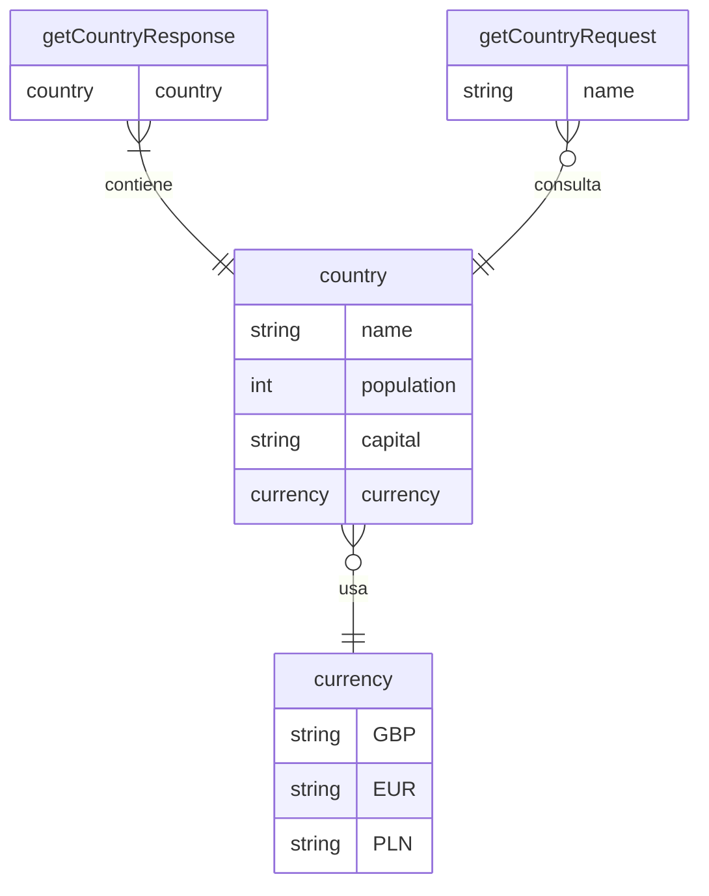

```mermaid
erDiagram
    getCountryRequest {
        string name
    }
    getCountryResponse {
        country country
    }
    country {
        string name
        int population
        string capital
        currency currency
    }
    currency {
        string GBP
        string EUR
        string PLN
    }

    getCountryResponse }|--|| country : contiene
    country }o--|| currency : usa
    getCountryRequest }o--|| country : consulta
```
