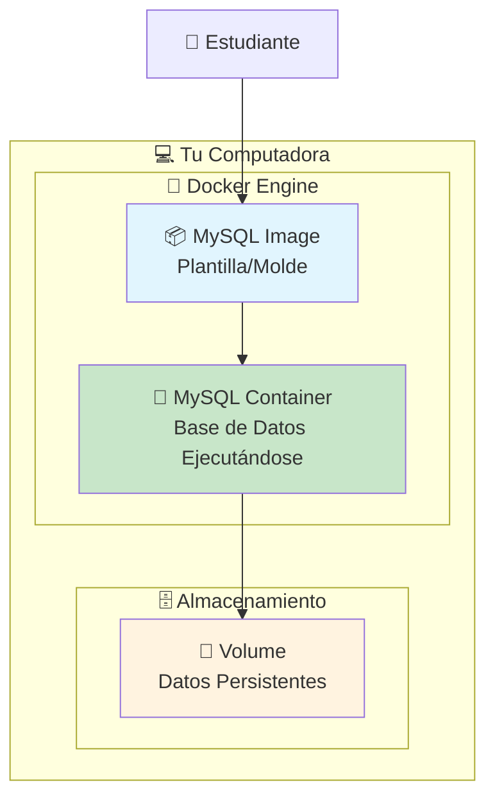

Este documento te guiará paso a paso para configurar una base de datos MySQL utilizando Docker, preparándote para el tutorial de **"Integración de Base de Datos MySQL con Quarkus"**.

---

## 📋 Requisitos Previos

- Tener Docker Desktop instalado en tu sistema
- Conocimientos básicos de línea de comandos (terminal/bash)
- Terminal o línea de comandos disponible

---

## 🐳 Paso 1: Verificar la Instalación de Docker

Antes de comenzar, verifica que Docker esté correctamente instalado y funcionando.

### 1.1 Verificar Docker Engine

Abre una terminal y ejecuta:

```bash
docker --version
```

**Salida esperada:**
```bash
Docker version 24.0.7, build afdd53b
```

### 1.2 Verificar Docker Compose (Opcional pero Recomendado)

```bash
docker-compose --version
```

**Salida esperada:**
```bash
Docker Compose version v2.21.0
```

### 1.3 Verificar que Docker está Ejecutándose

```bash
docker info
```

Si ves información detallada del sistema Docker, está funcionando correctamente.

---

## 🎯 Paso 2: Entender los Conceptos Básicos

### 2.1 ¿Qué es una Imagen Docker?

Una **imagen Docker** es como una "plantilla" o "molde" que contiene:
- El sistema operativo base
- MySQL Server
- Configuraciones predeterminadas
- Dependencias necesarias

### 2.2 ¿Qué es un Contenedor Docker?

Un **contenedor** es una instancia en ejecución de una imagen. Es como crear una "caja virtual" a partir del molde.

### 2.3 Diagrama Visual



---

## 📥 Paso 3: Descargar la Imagen de MySQL

### 3.1 Buscar la Imagen Oficial de MySQL

```bash
docker search mysql
```

**💡 Explicación:** Este comando busca imágenes de MySQL disponibles en Docker Hub (repositorio público de imágenes Docker).

### 3.2 Descargar la Imagen Oficial de MySQL

```bash
docker pull mysql:8.0
```

**💡 Explicación:**
- `docker pull`: Comando para descargar una imagen
- `mysql`: Nombre de la imagen oficial
- `8.0`: Versión específica (tag) de MySQL

**Salida esperada:**
```bash
8.0: Pulling from library/mysql
72a69066d2fe: Pull complete
93619dbc5b36: Pull complete
99da31dd6142: Pull complete
...
Status: Downloaded newer image for mysql:8.0
```

### 3.3 Verificar que la Imagen se Descargó

```bash
docker images
```

**Salida esperada:**
```bash
REPOSITORY   TAG       IMAGE ID       CREATED        SIZE
mysql        8.0       3218b38490ce   2 weeks ago    516MB
```

---

## 🗂️ Paso 4: Preparar el Entorno de Trabajo

### 4.1 Crear un Directorio para el Proyecto

```bash
mkdir mysql-quarkus-project
cd mysql-quarkus-project
```

### 4.2 Crear Directorio para Datos Persistentes

```bash
mkdir mysql-data
```

**💡 Explicación:** Este directorio almacenará los datos de la base de datos en tu computadora, para que no se pierdan cuando detengas el contenedor.

---

## 🚀 Paso 5: Ejecutar MySQL Container - Versión Básica

### 5.1 Ejecutar el Contenedor con Configuración Básica

```bash
docker run --name mysql-quarkus \
  -e MYSQL_ROOT_PASSWORD=root_password \
  -e MYSQL_DATABASE=reservation_system \
  -e MYSQL_USER=quarkus_user \
  -e MYSQL_PASSWORD=quarkus_password \
  -p 3306:3306 \
  -d mysql:8.0
```

**💡 Explicación línea por línea:**

- `docker run`: Comando para crear y ejecutar un contenedor
- `--name mysql-quarkus`: Asigna el nombre "mysql-quarkus" al contenedor
- `-e MYSQL_ROOT_PASSWORD=root_password`: Variable de entorno para la contraseña root
- `-e MYSQL_DATABASE=reservation_system`: Crea automáticamente esta base de datos
- `-e MYSQL_USER=quarkus_user`: Crea este usuario adicional
- `-e MYSQL_PASSWORD=quarkus_password`: Contraseña para el usuario adicional
- `-p 3306:3306`: Mapea el puerto 3306 del contenedor al puerto 3306 de tu computadora
- `-d`: Ejecuta el contenedor en segundo plano (detached mode)
- `mysql:8.0`: La imagen que utilizaremos

### 5.2 Verificar que el Contenedor está Ejecutándose

```bash
docker ps
```

**Salida esperada:**
```bash
CONTAINER ID   IMAGE       COMMAND                  CREATED         STATUS         PORTS                    NAMES
abc123def456   mysql:8.0   "docker-entrypoint.s…"   2 minutes ago   Up 2 minutes   0.0.0.0:3306->3306/tcp   mysql-quarkus
```

---

## 🔍 Paso 6: Verificar la Conectividad

### 6.1 Ver los Logs del Contenedor

```bash
docker logs mysql-quarkus
```

**Busca esta línea que indica que MySQL está listo:**
```bash
[System] [MY-010931] [Server] /usr/sbin/mysqld: ready for connections.
```

### 6.2 Probar la Conexión desde Otro Contenedor

```bash
docker run -it --rm mysql:8.0 mysql -h host.docker.internal -P 3306 -u quarkus_user -p
```

**💡 Explicación:**
- `-it`: Modo interactivo con terminal
- `--rm`: Elimina el contenedor temporal después de usarlo
- `-h host.docker.internal`: Conecta al host desde dentro del contenedor

**Cuando te pida la contraseña, escribe:** `quarkus_password`

---

## 📊 Paso 7: Preparar la Base de Datos para Quarkus

### 7.1 Conectar y Crear la Tabla

Una vez conectado a MySQL, ejecuta estos comandos:

```sql
-- Verificar que estamos en la base de datos correcta
USE reservation_system;

-- Crear la tabla de reservaciones
CREATE TABLE reservations (
    id_reservation INT AUTO_INCREMENT PRIMARY KEY,
    id_client INT NOT NULL,
    id_room INT NOT NULL,
    instructor VARCHAR(100),
    discount DECIMAL(5,2),
    created_at TIMESTAMP DEFAULT CURRENT_TIMESTAMP,
    updated_at TIMESTAMP DEFAULT CURRENT_TIMESTAMP ON UPDATE CURRENT_TIMESTAMP
);

-- Insertar datos de ejemplo
INSERT INTO reservations (id_client, id_room, instructor, discount) VALUES
(1001, 5, 'Juan Pérez', 10.50),
(1002, 3, 'Ana López', 15.00),
(1003, 7, 'Carlos Ruiz', NULL);

-- Verificar los datos
SELECT * FROM reservations;

-- Salir de MySQL
EXIT;
```

### 7.2 Verificar la Estructura de la Tabla

```sql
DESCRIBE reservations;
```

**Salida esperada:**
```bash
+----------------+---------------+------+-----+-------------------+-------------------+
| Field          | Type          | Null | Key | Default           | Extra             |
+----------------+---------------+------+-----+-------------------+-------------------+
| id_reservation | int           | NO   | PRI | NULL              | auto_increment    |
| id_client      | int           | NO   |     | NULL              |                   |
| id_room        | int           | NO   |     | NULL              |                   |
| instructor     | varchar(100)  | YES  |     | NULL              |                   |
| discount       | decimal(5,2)  | YES  |     | NULL              |                   |
| created_at     | timestamp     | YES  |     | CURRENT_TIMESTAMP | DEFAULT_GENERATED |
| updated_at     | timestamp     | YES  |     | CURRENT_TIMESTAMP | DEFAULT_GENERATED on update CURRENT_TIMESTAMP |
+----------------+---------------+------+-----+-------------------+-------------------+
```

---

## 🔧 Paso 8: Versión Avanzada con Docker Compose (Recomendado)

### 8.1 Crear archivo docker-compose.yml

Para mayor comodidad, crea un archivo `docker-compose.yml` en tu directorio de proyecto:

```yaml
version: '3.8'

services:
  mysql:
    image: mysql:8.0
    container_name: mysql-quarkus
    restart: always
    environment:
      MYSQL_ROOT_PASSWORD: root_password
      MYSQL_DATABASE: reservation_system
      MYSQL_USER: quarkus_user
      MYSQL_PASSWORD: quarkus_password
    ports:
      - "3306:3306"
    volumes:
      - ./mysql-data:/var/lib/mysql
      - ./init-scripts:/docker-entrypoint-initdb.d
    networks:
      - quarkus-network

networks:
  quarkus-network:
    driver: bridge
```

### 8.2 Crear Script de Inicialización (Opcional)

Crea un directorio y archivo para inicializar automáticamente la base de datos:

```bash
mkdir init-scripts
```

Crea el archivo `init-scripts/01-create-table.sql`:

```sql
-- Este script se ejecuta automáticamente al iniciar el contenedor por primera vez

USE reservation_system;

CREATE TABLE reservations (
    id_reservation INT AUTO_INCREMENT PRIMARY KEY,
    id_client INT NOT NULL,
    id_room INT NOT NULL,
    instructor VARCHAR(100),
    discount DECIMAL(5,2),
    created_at TIMESTAMP DEFAULT CURRENT_TIMESTAMP,
    updated_at TIMESTAMP DEFAULT CURRENT_TIMESTAMP ON UPDATE CURRENT_TIMESTAMP
);

INSERT INTO reservations (id_client, id_room, instructor, discount) VALUES
(1001, 5, 'Juan Pérez', 10.50),
(1002, 3, 'Ana López', 15.00),
(1003, 7, 'Carlos Ruiz', NULL);
```

### 8.3 Ejecutar con Docker Compose

```bash
# Detener el contenedor anterior si está ejecutándose
docker stop mysql-quarkus
docker rm mysql-quarkus

# Ejecutar con Docker Compose
docker-compose up -d
```

**💡 Ventajas de Docker Compose:**
- Configuración más organizada
- Fácil recreación del entorno
- Manejo automático de redes
- Persistencia de datos garantizada

---

## 🧪 Paso 9: Probar la Conexión desde una Aplicación Externa

### 9.1 Información de Conexión para Quarkus

Para tu archivo `application.properties` en Quarkus:

```properties
# Configuración de la base de datos MySQL con Docker
quarkus.datasource.db-kind=mysql
quarkus.datasource.username=quarkus_user
quarkus.datasource.password=quarkus_password
quarkus.datasource.jdbc.url=jdbc:mysql://localhost:3306/reservation_system

# Configuración de Hibernate
quarkus.hibernate-orm.database.generation=none
quarkus.hibernate-orm.log.sql=true
quarkus.hibernate-orm.sql-load-script=no-file

# Configuración del pool de conexiones
quarkus.datasource.jdbc.min-size=2
quarkus.datasource.jdbc.max-size=10
```

### 9.2 Probar Conexión con un Cliente MySQL

Si tienes un cliente MySQL instalado localmente:

```bash
mysql -h 127.0.0.1 -P 3306 -u quarkus_user -p reservation_system
```

### 9.3 Usar MySQL Workbench o phpMyAdmin

**Configuración de conexión:**
- **Host:** `localhost` o `127.0.0.1`
- **Puerto:** `3306`
- **Usuario:** `quarkus_user`
- **Contraseña:** `quarkus_password`
- **Base de datos:** `reservation_system`

---

## 🔄 Paso 10: Comandos de Gestión del Contenedor

### 10.1 Comandos Básicos de Gestión

```bash
# Ver contenedores en ejecución
docker ps

# Ver todos los contenedores (incluidos los detenidos)
docker ps -a

# Detener el contenedor
docker stop mysql-quarkus

# Iniciar el contenedor
docker start mysql-quarkus

# Reiniciar el contenedor
docker restart mysql-quarkus

# Ver logs en tiempo real
docker logs -f mysql-quarkus

# Acceder al contenedor (shell interactivo)
docker exec -it mysql-quarkus bash
```

### 10.2 Comandos para Docker Compose

```bash
# Iniciar servicios
docker-compose up -d

# Detener servicios
docker-compose down

# Ver logs
docker-compose logs mysql

# Reconstruir y reiniciar
docker-compose down && docker-compose up -d
```

---

## 🛠️ Paso 11: Solución de Problemas Comunes

### 11.1 El contenedor no inicia

**Verificar logs:**
```bash
docker logs mysql-quarkus
```

**Problema común:** Puerto 3306 ya en uso
**Solución:** Cambiar el puerto en el comando docker run:
```bash
-p 3307:3306  # Mapea el puerto 3307 de tu PC al 3306 del contenedor
```

### 11.2 No puedo conectarme desde la aplicación

**Verificar que el contenedor está ejecutándose:**
```bash
docker ps
```

**Verificar la conectividad:**
```bash
telnet localhost 3306
```

### 11.3 Datos se pierden al reiniciar

**Asegúrate de usar volúmenes:**
```bash
-v ./mysql-data:/var/lib/mysql
```

### 11.4 Error de autenticación

**Problema común:** Plugin de autenticación
**Solución:** Conectar y cambiar plugin:
```sql
ALTER USER 'quarkus_user'@'%' IDENTIFIED WITH mysql_native_password BY 'quarkus_password';
FLUSH PRIVILEGES;
```

---

## 🧹 Paso 12: Limpieza y Mantenimiento

### 12.1 Eliminar Contenedor y Datos

```bash
# Detener y eliminar contenedor
docker stop mysql-quarkus
docker rm mysql-quarkus

# Eliminar imagen (opcional)
docker rmi mysql:8.0

# Eliminar volumen de datos (¡CUIDADO! Esto borra todos los datos)
rm -rf mysql-data/
```

### 12.2 Backup de la Base de Datos

```bash
# Crear backup
docker exec mysql-quarkus mysqldump -u quarkus_user -p reservation_system > backup.sql

# Restaurar backup
docker exec -i mysql-quarkus mysql -u quarkus_user -p reservation_system < backup.sql
```

---

## 📋 Resumen de Comandos Esenciales

### Flujo Completo Paso a Paso:

1. **Preparar entorno:**
   ```bash
   mkdir mysql-quarkus-project && cd mysql-quarkus-project
   ```

2. **Ejecutar MySQL:**
   ```bash
   docker run --name mysql-quarkus -e MYSQL_ROOT_PASSWORD=root_password -e MYSQL_DATABASE=reservation_system -e MYSQL_USER=quarkus_user -e MYSQL_PASSWORD=quarkus_password -p 3306:3306 -d mysql:8.0
   ```

3. **Verificar:**
   ```bash
   docker ps
   docker logs mysql-quarkus
   ```

4. **Conectar y configurar:**
   ```bash
   docker exec -it mysql-quarkus mysql -u quarkus_user -p
   ```

---

## 🎯 Próximos Pasos

¡Perfecto! Ahora tienes MySQL ejecutándose en Docker y listo para usar con Quarkus. 

**Continúa con el documento:** [**"Integración de Base de Datos MySQL con Quarkus"**](Integración%20de%20Base%20de%20Datos.md)

**En el siguiente tutorial aprenderás:**
- Configurar Quarkus para conectarse a tu base de datos Docker
- Crear entidades JPA
- Implementar operaciones CRUD completas
- Probar todo el flujo end-to-end

**💡 Consejos para el siguiente paso:**
- Mantén el contenedor MySQL ejecutándose
- Guarda la información de conexión (usuario: `quarkus_user`, contraseña: `quarkus_password`)
- Tu base de datos `reservation_system` ya está lista con la tabla `reservations`
