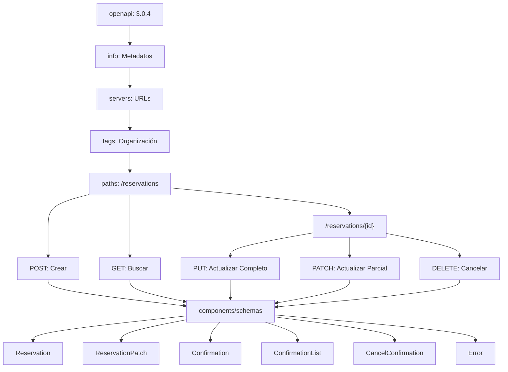

# 📚 Guía Paso a Paso

## 🎯 Objetivo

Aprender a crear un contrato OpenAPI desde cero, entendiendo cada elemento y construyendo progresivamente las operaciones de una API REST.

---

## 📖 ¿Qué es OpenAPI Specification (OAS)?

**OpenAPI Specification** es un estándar para describir APIs REST de manera clara y comprensible, permitiendo:

- **Documentación automática** (Swagger UI)
- **Generación de código** (cliente y servidor)
- **Validación** de requests/responses
- **Testing automatizado**

---

## 🏗️ Paso 1: Estructura Básica del Documento

Comenzamos con el esqueleto mínimo:

```yaml
openapi: 3.0.4 # Versión de OpenAPI que usaremos
```

### ¿Por qué empezar aquí?

- `openapi: 3.0.4` es la versión más reciente y estable
- **Obligatorio**: Todo documento OAS debe empezar con esto

---

## ## 📋 Paso 2: Información General (info)

Agregamos metadatos del proyecto:

```yaml
openapi: 3.0.4
info:
  title: Gym Reservation API           # Nombre de tu API
  description: API REST para gestión de reservas de gimnasio
  version: 1.0.0                      # Versión de tu API
  contact:
    name: ITQ distributed and cloud systems
    email: ivonne.al@queretaro.tecnm.mx
  license:
    name: Apache 2.0
    url: https://www.apache.org/licenses/LICENSE-2.0.html
```

### Elementos explicados:

- **`title`**: Nombre que aparecerá en la documentación
- **`description`**: Explicación breve de qué hace la API
- **`version`**: Versión semántica (1.0.0, 1.2.3, etc.)
- **`contact`**: Información de contacto del equipo
- **`license`**: Licencia bajo la cual se distribuye

---

## ## 🌐 Paso 3: Servidores (servers)

Definimos dónde está disponible la API:

```yaml
openapi: 3.0.4
info:
  # ... información anterior ...

servers:
  - url: http://localhost:8080/api/v1
    description: Servidor de desarrollo
  - url: https://api.gym.com/api/v1
    description: Servidor de producción
```

### ¿Para qué sirve?

- **Múltiples ambientes**: desarrollo, pruebas, producción
- **URL base**: Todas las rutas se construyen desde aquí
- **Flexibilidad**: Cambiar fácilmente entre ambientes

---

## 🏷️ Paso 4: Etiquetas (tags)

Organizamos las operaciones por categorías:

```yaml
openapi: 3.0.4
info:
  # ... información anterior ...
servers:
  # ... servidores anteriores ...

tags:
  - name: Reservations
    description: Operaciones relacionadas con reservas del gimnasio
```

### Beneficio:

- **Organización**: Agrupa operaciones similares
- **Documentación clara**: Secciones en Swagger UI
- **Navegación fácil**: Encuentra rápido lo que buscas

---

## ## 🛣️ Paso 5: Primera Operación - Crear Reserva (POST)

Construimos nuestra primera operación paso a paso:

```yaml
paths:
  /reservations:    # Ruta del endpoint
    post:           # Método HTTP
      summary: Crear nueva reserva
      description: Crea una nueva reserva en el gimnasio
      operationId: createReservation    # ID único para generación de código
      tags:
        - Reservations                  # Asociamos con el tag creado
```

### Elementos explicados:

- **`paths`**: Contenedor de todas las rutas
- **`/reservations`**: La ruta específica (se une con servers)
- **`post`**: Método HTTP para crear recursos
- **`operationId`**: Nombre único, útil para generar código

---

## 📤 Paso 6: Request Body - Datos de Entrada

### 🎯 Enfoque Progresivo: De Campos Simples a Esquemas Reutilizables

**Es importante entender que OpenAPI permite dos enfoques para definir datos:**

#### **Enfoque 1: Definición Directa (Para empezar)**

```yaml
paths:
  /reservations:
    post:
      # ... elementos anteriores ...
      requestBody:
        required: true                  # Es obligatorio enviar datos
        content:
          application/json:             # Formato de los datos
            schema:                     # Schema definido DIRECTAMENTE aquí
              type: object
              required:
                - idClient
                - activity
                - dayOfWeek
                - time
              properties:
                idClient:
                  type: string
                  pattern: '^[BP]C-[0-9]{3}$'
                  example: "BC-123"
                activity:
                  type: string
                  minLength: 5
                  maxLength: 255
                  example: "Yoga"
                dayOfWeek:
                  type: string
                  enum: [Lun, Mar, Mie, Jue, Vie, Sab, Dom]
                  example: "Lun"
                time:
                  type: string
                  format: time
                  example: "09:00"
```

#### **Enfoque 2: Referencia a Schema Reutilizable (Recomendado)**

```yaml
paths:
  /reservations:
    post:
      # ... elementos anteriores ...
      requestBody:
        required: true                  # Es obligatorio enviar datos
        content:
          application/json:             # Formato de los datos
            schema:
              $ref: '#/components/schemas/Reservation'  # Referencia al esquema
            example:                    # Ejemplo para documentación
              idClient: "BC-123"
              activity: "Yoga"
              dayOfWeek: "Lun"
              time: "09:00"
```

### 🔄 **¿Cuándo usar cada enfoque?**

#### **Usa definición directa cuando:**

- ✅ Estés aprendiendo OpenAPI
- ✅ Tengas campos únicos que no se repiten
- ✅ Prototipes rápidamente

#### **Usa referencias ($ref) cuando:**

- ✅ Los mismos campos se usan en múltiples operaciones
- ✅ Quieras mantener el código organizado
- ✅ Desarrolles APIs en producción

### 📚 **Ejemplo Práctico: Evolución de Campos**

Imagina que empiezas con esto:

```yaml
# ❌ PROBLEMA: Repetición en múltiples lugares
paths:
  /reservations:
    post:
      requestBody:
        content:
          application/json:
            schema:
              type: object
              properties:
                idClient:
                  type: string
                  pattern: '^[BP]C-[0-9]{3}$'
                activity:
                  type: string
                  minLength: 5
                # ... más campos ...
    
  /reservations/{id}:
    put:
      requestBody:
        content:
          application/json:
            schema:
              type: object
              properties:
                idClient:
                  type: string
                  pattern: '^[BP]C-[0-9]{3}$'    # ¡REPETIDO!
                activity:
                  type: string
                  minLength: 5                    # ¡REPETIDO!
                # ... mismos campos repetidos ...
```

**Entonces lo refactorizas a:**

```yaml
# ✅ SOLUCIÓN: Schema reutilizable
paths:
  /reservations:
    post:
      requestBody:
        content:
          application/json:
            schema:
              $ref: '#/components/schemas/Reservation'  # Referencia
    
  /reservations/{id}:
    put:
      requestBody:
        content:
          application/json:
            schema:
              $ref: '#/components/schemas/Reservation'  # Misma referencia

components:
  schemas:
    Reservation:                        # Definido UNA sola vez
      type: object
      required:
        - idClient
        - activity
        - dayOfWeek
        - time
      properties:
        idClient:
          type: string
          pattern: '^[BP]C-[0-9]{3}$'
        activity:
          type: string
          minLength: 5
          maxLength: 255
        # ... resto de campos ...
```

---

## 📊 **Ventajas de Usar Referencias ($ref)**

|Aspecto|Definición Directa|Referencia ($ref)|
|---|---|---|
|**Mantenimiento**|❌ Cambios en múltiples lugares|✅ Cambio en un solo lugar|
|**Legibilidad**|❌ Código repetitivo|✅ Código limpio|
|**Reutilización**|❌ Copy/paste manual|✅ Automática|
|**Consistencia**|❌ Fácil de desincronizar|✅ Siempre consistente|
|**Tamaño del archivo**|❌ Más grande|✅ Más compacto|

---

## 🔍 **Cuándo Convertir Campos a Schemas**

### **Señales de que necesitas crear un schema:**

1. **Repetición**: Usas los mismos campos en 2+ operaciones
2. **Complejidad**: Tienes más de 3-4 campos
3. **Validaciones complejas**: Patrones, rangos, formatos específicos
4. **Evolución**: Planeas agregar más campos en el futuro

### **Proceso de conversión:**

#### **Paso 1: Identifica la repetición**

```yaml
# ¿Usas estos campos en múltiples lugares?
properties:
  idClient:
    type: string
    pattern: '^[BP]C-[0-9]{3}$'
  activity:
    type: string
    minLength: 5
    maxLength: 255
```

#### **Paso 2: Extrae a components/schemas**

```yaml
components:
  schemas:
    Reservation:
      type: object
      required: [idClient, activity, dayOfWeek, time]
      properties:
        idClient:
          type: string
          pattern: '^[BP]C-[0-9]{3}$'
        activity:
          type: string
          minLength: 5
          maxLength: 255
        # ... más campos ...
```

#### **Paso 3: Reemplaza con referencias**

```yaml
# Antes:
schema:
  type: object
  properties:
    idClient: ...
    activity: ...

# Después:
schema:
  $ref: '#/components/schemas/Reservation'
```

### ¿Por qué usar `$ref`?

- **Reutilización**: El mismo esquema se usa en varias operaciones
- **Mantenimiento**: Cambios en un solo lugar
- **Legibilidad**: Evita repetir código
- **Escalabilidad**: Facilita el crecimiento de la API

### ¿Por qué `$ref`?

- **Reutilización**: El mismo esquema se usa en varias operaciones
- **Mantenimiento**: Cambios en un solo lugar
- **Legibilidad**: Evita repetir código

---

## 📥 Paso 7: Responses - Respuestas Posibles

Definimos todas las respuestas posibles:

```yaml
paths:
  /reservations:
    post:
      # ... elementos anteriores ...
      responses:
        '201':                          # Código HTTP de éxito
          description: Reserva creada exitosamente
          content:
            application/json:
              schema:
                $ref: '#/components/schemas/Confirmation'
              example:
                idReservation: 12345
                idRoom: 5
                instructor: "María García"
                discount: 10.50
        '400':                          # Error del cliente
          description: Datos de entrada inválidos
          content:
            application/json:
              schema:
                $ref: '#/components/schemas/Error'
        '409':                          # Conflicto
          description: Conflicto - horario no disponible
          content:
            application/json:
              schema:
                $ref: '#/components/schemas/Error'
        '500':                          # Error del servidor
          description: Error interno del servidor
          content:
            application/json:
              schema:
                $ref: '#/components/schemas/Error'
```

### Códigos HTTP explicados:

- **`201`**: Created (recurso creado exitosamente)
- **`400`**: Bad Request (datos inválidos)
- **`409`**: Conflict (recurso ya existe o conflicto)
- **`500`**: Internal Server Error (error del servidor)

---

## 🔍 Paso 8: Segunda Operación - Buscar Reservas (GET)

Agregamos operación de búsqueda en la misma ruta:

```yaml
paths:
  /reservations:
    post:
      # ... operación POST anterior ...
    
    get:                                # Nueva operación en la misma ruta
      summary: Buscar reservas
      description: Busca reservas existentes basado en criterios
      operationId: getReservations
      tags:
        - Reservations
      parameters:                       # Parámetros de consulta
        - name: idClient
          in: query                     # Tipo de parámetro
          description: ID del cliente (formato BC-XXX o PC-XXX)
          required: false               # Opcional
          schema:
            type: string
            pattern: '^[BP]C-[0-9]{3}$'    # Validación con regex
          example: "BC-123"
        - name: activity
          in: query
          description: Nombre de la actividad
          required: false
          schema:
            type: string
            minLength: 5
            maxLength: 255
          example: "Yoga"
        - name: dayOfWeek
          in: query
          description: Día de la semana
          required: false
          schema:
            type: string
            enum: [Lun, Mar, Mie, Jue, Vie, Sab, Dom]
          example: "Lun"
        - name: time
          in: query
          description: Hora de la actividad
          required: false
          schema:
            type: string
            format: time
          example: "09:00"
```

### Tipos de parámetros:

- **`query`**: ?param=value (filtros de búsqueda)
- **`path`**: /users/{id} (parte de la URL)
- **`header`**: En headers HTTP
- **`cookie`**: En cookies

---

## 📋 Paso 9: Responses de la Operación GET

```yaml
      responses:
        '200':
          description: Lista de reservas encontradas
          content:
            application/json:
              schema:
                $ref: '#/components/schemas/ConfirmationList'
              example:
                confirmations:
                  - idReservation: 12345
                    idRoom: 5
                    instructor: "María García"
                    discount: 10.50
                  - idReservation: 12346
                    idRoom: 3
                    instructor: "Juan Pérez"
                    discount: 0
        '400':
          description: Parámetros de búsqueda inválidos
          content:
            application/json:
              schema:
                $ref: '#/components/schemas/Error'
        '404':
          description: No se encontraron reservas
          content:
            application/json:
              schema:
                $ref: '#/components/schemas/Error'
```

---

## 🎯 Paso 10: Ruta con Parámetros - Operaciones por ID

Creamos operaciones que afectan a una reserva específica:

```yaml
paths:
  /reservations:
    # ... operaciones anteriores ...
  
  /reservations/{reservationId}:        # Parámetro en la ruta
    put:                                # Actualización completa
      summary: Actualizar reserva completa
      description: Actualiza todos los datos de una reserva existente
      operationId: updateReservation
      tags:
        - Reservations
      parameters:
        - name: reservationId           # Parámetro de la ruta
          in: path                      # Ubicación: en la URL
          description: ID de la reserva a actualizar
          required: true                # Los parámetros path son siempre obligatorios
          schema:
            type: integer
            format: int32
          example: 12345
      requestBody:
        required: true
        content:
          application/json:
            schema:
              $ref: '#/components/schemas/Reservation'
            example:
              idClient: "BC-123"
              activity: "Pilates"
              dayOfWeek: "Mar"
              time: "10:30"
      responses:
        '200':
          description: Reserva actualizada exitosamente
          content:
            application/json:
              schema:
                $ref: '#/components/schemas/Confirmation'
              example:
                idReservation: 12345
                idRoom: 8
                instructor: "Ana López"
                discount: 15.00
        '400':
          description: Datos de entrada inválidos
          content:
            application/json:
              schema:
                $ref: '#/components/schemas/Error'
        '404':
          description: Reserva no encontrada
          content:
            application/json:
              schema:
                $ref: '#/components/schemas/Error'
        '409':
          description: Conflicto - nuevo horario no disponible
          content:
            application/json:
              schema:
                $ref: '#/components/schemas/Error'
        '500':
          description: Error interno del servidor
          content:
            application/json:
              schema:
                $ref: '#/components/schemas/Error'
```

### ¿Por qué rutas separadas?

- **RESTful**: Seguimos convenciones REST
- **Claridad**: Operaciones sobre colección vs elemento específico
- **Organización**: Fácil de entender y mantener

---

## 🔧 Paso 11: Diferentes Tipos de Actualización

Agregamos PATCH para actualización parcial:

```yaml
    /reservations/{reservationId}:
    put:
        # ... operación PUT anterior ...
    
    patch:                                # Actualización parcial
      summary: Actualizar reserva parcialmente
      description: Actualiza solo los campos especificados de una reserva existente
      operationId: patchReservation
      tags:
        - Reservations
      parameters:
        - name: reservationId
          in: path
          description: ID de la reserva a actualizar
          required: true
          schema:
            type: integer
            format: int32
          example: 12345
      requestBody:
        required: true
        content:
          application/json:
            schema:
              $ref: '#/components/schemas/ReservationPatch'
            example:
              activity: "Zumba"
              time: "11:00"
      responses:
        '200':
          description: Reserva actualizada exitosamente
          content:
            application/json:
              schema:
                $ref: '#/components/schemas/Confirmation'
              example:
                idReservation: 12345
                idRoom: 5
                instructor: "María García"
                discount: 10.50
        '400':
          description: Datos de entrada inválidos
          content:
            application/json:
              schema:
                $ref: '#/components/schemas/Error'
        '404':
          description: Reserva no encontrada
          content:
            application/json:
              schema:
                $ref: '#/components/schemas/Error'
        '409':
          description: Conflicto - nuevo horario no disponible
          content:
            application/json:
              schema:
                $ref: '#/components/schemas/Error'
```

### PUT vs PATCH:

- **PUT**: Reemplaza **todo** el recurso (requiere todos los campos)
- **PATCH**: Actualiza **solo** los campos enviados (campos opcionales)

---

## 🗑️ Paso 12: Operación de Eliminación

Completamos CRUD con DELETE:

```yaml
    /reservations/{reservationId}:
    put:
        # ... operación PUT ...
    patch:
        # ... operación PATCH ...
    delete:
      summary: Cancelar reserva
      description: Cancela una reserva existente
      operationId: cancelReservation
      tags:
        - Reservations
      parameters:
        - name: reservationId
          in: path
          description: ID de la reserva a cancelar
          required: true
          schema:
            type: integer
            format: int32
          example: 12345
      responses:
        '200':
          description: Reserva cancelada exitosamente
          content:
            application/json:
              schema:
                $ref: '#/components/schemas/CancelConfirmation'
              example:
                idReservation: 12345
                status: "cancelled"
                message: "Reserva cancelada exitosamente"
        '404':
          description: Reserva no encontrada
          content:
            application/json:
              schema:
                $ref: '#/components/schemas/Error'
        '409':
          description: No se puede cancelar la reserva
          content:
            application/json:
              schema:
                $ref: '#/components/schemas/Error'
```

---

## 📦 Paso 13: Esquemas de Datos (components/schemas)

Definimos la estructura de nuestros datos:

```yaml
components:
  schemas:
    Reservation:                        # Esquema para crear/actualizar
      type: object
      description: Datos para crear una nueva reserva
      required:                         # Campos obligatorios
        - idClient
        - activity
        - dayOfWeek
        - time
      properties:                       # Definición de cada campo
        idClient:
          type: string
          description: Identificador del cliente
          pattern: '^[BP]C-[0-9]{3}$'   # Validación con regex
          example: "BC-123"
        activity:
          type: string
          description: Nombre de la actividad
          minLength: 5                   # Validación de longitud
          maxLength: 255
          example: "Yoga"
        dayOfWeek:
          type: string
          description: Día de la semana
          enum: [Lun, Mar, Mie, Jue, Vie, Sab, Dom]  # Valores permitidos
          example: "Lun"
        time:
          type: string
          description: Hora de la actividad
          format: time                   # Formato específico
          example: "09:00"
```

### Tipos de validaciones:

- **`pattern`**: Expresiones regulares
- **`minLength/maxLength`**: Longitud de strings
- **`minimum/maximum`**: Valores numéricos
- **`enum`**: Lista de valores permitidos
- **`format`**: Formatos estándar (date, time, email, etc.)

---

## 🔄 Paso 14: Esquemas Relacionados

Creamos esquemas para diferentes propósitos:

```yaml
components:
  schemas:
    Reservation:
      # ... esquema anterior ...
    
    ReservationPatch:                   # Para PATCH (campos opcionales)
      type: object
      description: Datos para actualización parcial de una reserva (todos los campos opcionales)
      properties:
        # ... mismos campos que Reservation pero SIN required
        idClient:
          type: string
          description: Identificador del cliente
          pattern: '^[BP]C-[0-9]{3}$'
          example: "BC-123"
        activity:
          type: string
          description: Nombre de la actividad
          minLength: 5
          maxLength: 255
          example: "Yoga"
        dayOfWeek:
          type: string
          description: Día de la semana
          enum: [Lun, Mar, Mie, Jue, Vie, Sab, Dom]
          example: "Lun"
        time:
          type: string
          description: Hora de la actividad
          format: time
          example: "09:00"
      additionalProperties: false        # No permite campos extra
```

---

## 📊 Paso 15: Esquemas de Respuesta

```yaml
    Confirmation:                       # Respuesta al crear/actualizar
      type: object
      description: Confirmación de reserva
      required:
        - idReservation
        - idRoom
      properties:
        idReservation:
          type: integer
          format: int32
          description: ID único de la reserva
          example: 12345
        idRoom:
          type: integer
          format: int32
          description: ID de la sala asignada
          minimum: 1
          maximum: 20
          example: 5
        instructor:
          type: string
          description: Nombre del instructor asignado
          maxLength: 255
          nullable: true                 # Puede ser null
          example: "María García"
        discount:
          type: number
          format: decimal
          description: Descuento aplicado
          multipleOf: 0.01              # Incrementos de centavos
          minimum: 0
          maximum: 999.99
          nullable: true
          example: 10.50
```

---

## 📋 Paso 16: Esquemas para Listas y Respuestas Especiales

```yaml
    ConfirmationList:                   # Para respuestas de búsqueda
      type: object
      description: Lista de confirmaciones de reservas
      properties:
        confirmations:
          type: array                   # Array de objetos
          items:
            $ref: '#/components/schemas/Confirmation'
          description: Array de confirmaciones
        total:
          type: integer
          description: Total de reservas encontradas
          example: 2
    
    CancelConfirmation:                 # Para cancelaciones
      type: object
      description: Confirmación de cancelación
      required:
        - idReservation
        - status
      properties:
        idReservation:
          type: integer
          format: int32
          description: ID de la reserva cancelada
          example: 12345
        status:
          type: string
          description: Estado de la cancelación
          enum: [cancelled, failed]     # Estados posibles
          example: "cancelled"
        message:
          type: string
          description: Mensaje descriptivo
          example: "Reserva cancelada exitosamente"
        cancelledAt:
          type: string
          format: date-time             # Formato ISO 8601
          description: Fecha y hora de cancelación
          example: "2024-01-15T10:30:00Z"
```

---

## ⚠️ Paso 17: Manejo de Errores

```yaml
    Error:                              # Manejo consistente de errores
      type: object
      description: Respuesta de error estándar
      required:
        - code
        - message
      properties:
        code:
          type: string
          description: Código de error
          example: "INVALID_CLIENT_ID"
        message:
          type: string
          description: Mensaje de error legible
          example: "El ID del cliente debe seguir el formato BC-XXX o PC-XXX"
        details:
          type: object
          description: Detalles adicionales del error
          additionalProperties: true    # Permite cualquier propiedad adicional
```

---

## 🎯 Paso 18: Verificación y Validación

### Checklist de completitud:

#### ✅ **Operaciones CRUD completas:**

- **C**reate: `POST /reservations`
- **R**ead: `GET /reservations` (lista)
- **U**pdate: `PUT /reservations/{id}` (completa), `PATCH /reservations/{id}` (parcial)
- **D**elete: `DELETE /reservations/{id}`

#### ✅ **Códigos HTTP apropiados:**

- `200`: OK (lectura, actualización, eliminación)
- `201`: Created (creación)
- `400`: Bad Request (datos inválidos)
- `404`: Not Found (recurso no existe)
- `409`: Conflict (conflicto de estado)
- `500`: Internal Server Error

#### ✅ **Validaciones completas:**

- Formatos de datos (pattern, format)
- Rangos de valores (min/max)
- Longitudes de strings
- Campos obligatorios vs opcionales

#### ✅ **Documentación clara:**

- Descripciones en todos los elementos
- Ejemplos en requests y responses
- Información de contacto y licencia

---

## 🧪 Paso 19: Herramientas para Probar

### Swagger UI:

1. Copia tu archivo YAML
2. Ve a [https://editor.swagger.io/](vscode-file://vscode-app/Applications/Visual%20Studio%20Code.app/Contents/Resources/app/out/vs/code/electron-browser/workbench/workbench.html)
3. Pega el contenido
4. Interactúa con la documentación

### Comando para validar:

```bash
# Si tienes swagger-codegen instalado
swagger-codegen validate -i GymReservation.yaml
```

---

## 💡 Conceptos Clave Aprendidos

|Concepto|Propósito|Ejemplo|
|---|---|---|
|**`openapi`**|Versión del estándar|`3.0.4`|
|**`info`**|Metadatos de la API|título, versión, contacto|
|**`servers`**|URLs donde está la API|desarrollo, producción|
|**`tags`**|Organización de operaciones|`Reservations`|
|**`paths`**|Endpoints disponibles|`/reservations`, `/reservations/{id}`|
|**Métodos HTTP**|Operaciones CRUD|`GET`, `POST`, `PUT`, `PATCH`, `DELETE`|
|**`parameters`**|Datos de entrada|query, path, header|
|**`requestBody`**|Datos en el cuerpo|JSON para POST/PUT/PATCH|
|**`responses`**|Respuestas posibles|códigos HTTP + schemas|
|**`components/schemas`**|Estructuras de datos|objetos reutilizables|
|**Validaciones**|Reglas de datos|pattern, min/max, enum|

---

## 📈 Resumen del Flujo Construido



---

## 🚀 Próximos Pasos

1. **Generar código**: Usar herramientas como OpenAPI Generator
2. **Implementar**: Crear el servidor basado en el contrato
3. **Testing**: Usar el contrato para pruebas automatizadas
4. **Documentación viva**: Integrar Swagger UI en tu aplicación

**¡Has completado tu primer contrato OpenAPI profesional!** 🎉